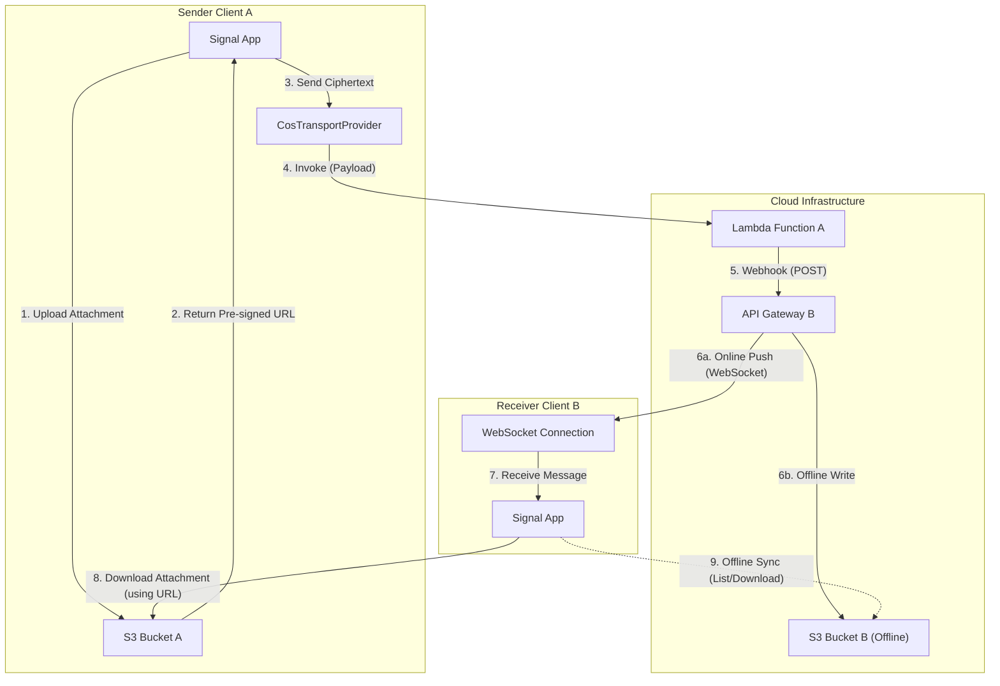

```mermaid
graph TD
    subgraph Sender ["Sender Client A"]
        A_App[Signal App]
        A_TP[CosTransportProvider]
        A_S3[S3 Bucket A]
    end

    subgraph Cloud ["Cloud Infrastructure"]
        Lambda[Lambda Function A]
        Gateway[API Gateway B]
        S3_Offline["S3 Bucket B (Offline)"]
    end

    subgraph Receiver ["Receiver Client B"]
        B_App[Signal App]
        B_WS[WebSocket Connection]
    end

    %% Flow
    A_App -->|"1. Upload Attachment"| A_S3
    A_S3 -->|"2. Return Pre-signed URL"| A_App
    A_App -->|"3. Send Ciphertext"| A_TP
    A_TP -->|"4. Invoke (Payload)"| Lambda
    Lambda -->|"5. Webhook (POST)"| Gateway
    Gateway -->|"6a. Online Push (WebSocket)"| B_WS
    Gateway -->|"6b. Offline Write"| S3_Offline
    B_WS -->|"7. Receive Message"| B_App
    B_App -->|"8. Download Attachment (using URL)"| A_S3
    B_App -.->|"9. Offline Sync (List/Download)"| S3_Offline
```
