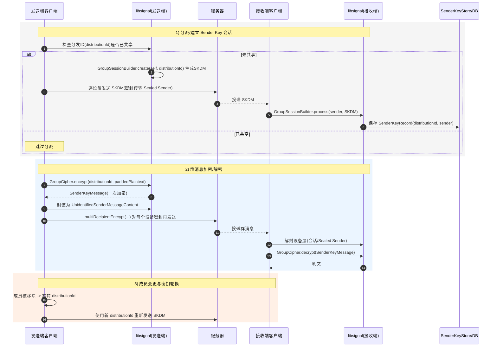

# Signal COS 混合通信架构实施计划

## 项目概述

本计划旨在实现Signal的混合通信架构：保留首次密钥交换通过Signal Server进行，但后续所有消息传递和Double Ratchet密钥轮换通过COS (Cloud Object Storage) 进行。这样可以在Signal Server崩溃时仍保持已建立联系的双方通信能力。

## 1. 可行性分析

### 1.1 技术可行性

**✅ 优势:**
1. **COS模块已完备**: 现有COS模块提供了完整的云存储接口，支持AWS S3和腾讯云COS
2. **CAM临时凭证机制**: 已实现临时访问令牌生成，可安全共享目录访问权限
3. **Double Ratchet独立性**: Signal的Double Ratchet实现相对独立，可以脱离Signal Server运行
4. **消息格式标准化**: Signal使用Protobuf格式，便于在COS中存储和传输

**⚠️ 挑战:**
1. **实时性问题**: COS轮询机制无法提供WebSocket级别的实时性
2. **消息顺序保证**: 需要设计机制确保消息按正确顺序处理
3. **并发冲突**: 双方同时发送消息时可能产生文件冲突
4. **垃圾回收**: 需要定期清理已读取的消息文件

### 1.2 安全性分析

**✅ 安全优势:**
1. **端到端加密保持**: Double Ratchet加密在COS层面之上，COS只存储密文
2. **访问控制**: CAM临时凭证限制访问权限和时效
3. **前向安全**: Double Ratchet的前向安全性不受传输层影响

**⚠️ 安全考虑:**
1. **元数据泄露**: 文件名、时间戳等元数据可能泄露通信模式
2. **COS提供商风险**: 依赖第三方云存储提供商的安全性
3. **CAM凭证管理**: 需要安全地交换和更新临时凭证

## 2. 架构设计

### 2.1 整体架构

```
┌─────────────────┐    正常通信     ┌─────────────────┐
│   Signal A      │ ←──────────────→ │   Signal B      │
│                 │   (Signal Server) │                 │
└─────────────────┘                  └─────────────────┘
         │                                    │
         │ 1. COS请求(含A的CAM)                │
         │ 2. COS响应(含B的CAM)                │
         │ 3. COS通信                          │
         ▼                                    ▼
┌─────────────────┐                  ┌─────────────────┐
│   COS Bucket A  │                  │   COS Bucket B  │
│   /outbox/      │ ──────────────→  │   /outbox/      │
│   (A发送给B)     │   B轮询读取A的    │   (B发送给A)     │
│                 │ ←──────────────  │                 │
└─────────────────┘   A轮询读取B的    └─────────────────┘

CAM权限说明:
- A分享给B: A的COS /outbox/ 目录读权限
- B分享给A: B的COS /outbox/ 目录读权限
- 发送消息: 上传到自己的 /outbox/
- 接收消息: 轮询对方的 /outbox/
- CAM Pool: 维护所有有效的CAM凭证
```

### 2.2 消息流程

#### 2.2.1 首次通信流程
1. **触发条件**: 用户首次向某个联系人发送消息
2. **X3DH协商**: 通过Signal Server获取预密钥，建立Double Ratchet会话
3. **CAM生成**: 生成长期CAM凭证，授权对方访问自己的COS目录
4. **CAM交换**: 将CAM凭证通过Signal Server发送给对方
5. **模式切换**: 双方都收到CAM后，切换到COS通信模式

#### 2.2.2 后续通信流程
1. **消息加密**: 使用Double Ratchet加密消息
2. **COS上传**: 将密文和Ratchet信息上传到自己的COS
3. **轮询接收**: 定期轮询对方COS目录获取新消息
4. **消息解密**: 下载密文并使用Double Ratchet解密
5. **状态更新**: 更新本地Double Ratchet状态

## 3. 关键问题分析

### 3.2 问题2: Double Ratchet需要传递哪些信息？

**分析**: 根据Signal的Double Ratchet实现，每条消息需要包含以下信息用于密钥轮换：

**必需的Ratchet信息**:
1. **消息序号** (Message Number): 用于消息排序和重放检测
2. **链序号** (Chain Number): 标识当前密钥链
3. **Ratchet公钥** (Ratchet Public Key): 用于密钥协商的临时公钥
4. **前一个链长度** (Previous Chain Length): 用于计算跳过的消息密钥

**传递方式**: **与密文一起传递**

**COS消息格式设计**:
```json
{
    "messageId": "uuid-v4",
    "timestamp": 1640995200000,
    "senderId": "sender-service-id",
    "recipientId": "recipient-service-id",
    "ratchetInfo": {
        "messageNumber": 42,
        "chainNumber": 3,
        "ratchetPublicKey": "base64-encoded-key",
        "previousChainLength": 15
    },
    "encryptedContent": "base64-encoded-ciphertext",
    "contentType": "text|attachment|typing|receipt",
    "attachmentInfo": {
        "fileName": "optional-attachment-filename",
        "size": 1024
    }
}
```

**文件存储路径**:
```
发送方上传到: /outbox/messages/{timestamp}_{message_number}_{chain_number}_{random}.json
接收方轮询: 对方的/outbox/messages/目录
```

### 3.3 问题3: CAM Pool如何管理？

**CAM Pool设计**:
- 维护所有有效的CAM凭证
- 支持凭证过期检测和自动清理
- 智能轮询策略优化性能
- 错误处理和重试机制

**轮询策略**:
- 活跃对话: 5秒间隔
- 非活跃对话: 30秒间隔
- 长期无活动: 5分钟间隔
- 错误过多: 暂停轮询

## 4. 实施计划

### 4.1 阶段一: 基础设施准备 (1-2周)

#### 4.1.1 COS请求管理系统
- 实现COS请求的发送和处理功能
- 支持请求状态跟踪和管理
- 实现请求响应和访问权限撤销

#### 4.1.2 COS通道管理系统
- 建立和维护COS通信通道
- 管理通道状态和Token刷新
- 处理通道异常和撤销

#### 4.1.3 COS消息管理系统
- 实现消息上传和下载功能
- 管理消息状态和已读标记
- 实现消息清理和历史记录管理

#### 4.1.4 消息轮询服务
- 基于CAM Pool的智能轮询
- 动态调整轮询频率
- 错误处理和恢复机制

### 4.2 阶段二: UI和用户交互 (2-3周)

#### 4.2.1 COS请求发送界面
- 在聊天界面添加COS通信请求功能
- 实现请求配置和状态显示
- 提供用户友好的交互体验

#### 4.2.2 COS请求接收界面
- 显示收到的COS请求
- 提供接受/拒绝选项
- 显示请求详细信息

#### 4.2.3 COS状态指示
- 显示当前通信状态
- 提供错误和警告提示
- 支持状态更新通知

### 4.3 阶段三: 消息接收集成 (2-3周)

#### 4.3.1 消息接收流程改造
- 整合CAM交换机制
- 实现COS轮询服务
- 处理COS消息接收

#### 4.3.2 消息处理系统
- 实现COS消息处理
- 集成Double Ratchet加密
- 处理消息状态更新

### 4.4 阶段四: 用户界面和配置 (1-2周)

#### 4.4.1 通信状态显示
- 显示当前通信模式
- 提供状态切换选项
- 显示连接质量信息

#### 4.4.2 设置界面增强
- 添加COS相关配置选项
- 提供轮询间隔设置
- 支持通道状态管理

#### 4.4.3 错误处理机制
- 实现自动故障转移
- 提供手动切换选项
- 错误提示和恢复指导

### 4.5 阶段五: 测试和优化 (2-3周)

#### 4.5.1 单元测试
- 核心功能单元测试
- 边界条件测试
- 异常处理测试

#### 4.5.2 集成测试
- 端到端通信测试
- 性能和负载测试
- 故障转移测试

#### 4.5.3 安全测试
- 加密和认证测试
- 权限控制测试
- 隐私保护评估

## 5. 技术实现细节

### 5.1 消息序列化格式

**CosMessage数据结构**:
```kotlin
data class CosMessage(
    val messageId: String,
    val timestamp: Long,
    val senderId: String,
    val recipientId: String,
    val ratchetInfo: RatchetInfo,
    val encryptedContent: ByteArray,
    val contentType: ContentType,
    val attachmentInfo: AttachmentInfo?
)

data class RatchetInfo(
    val messageNumber: Int,
    val chainNumber: Int,
    val ratchetPublicKey: ByteArray,
    val previousChainLength: Int
)
```

### 5.2 文件存储结构

```
COS Bucket:
├── shared/
│   ├── {recipient_id_1}/
│   │   ├── inbox/
│   │   │   ├── {timestamp}_{msg_num}_{chain_num}.json
│   │   │   └── ...
│   │   └── attachments/
│   │       ├── {attachment_id}.bin
│   │       └── ...
│   └── {recipient_id_2}/
│       └── ...
└── temp/
    └── {temp_files}
```

### 5.3 轮询策略

**智能轮询机制**:
1. **活跃对话**: 5秒间隔轮询
2. **非活跃对话**: 30秒间隔轮询
3. **后台模式**: 60秒间隔轮询
4. **网络异常**: 指数退避重试

### 5.4 冲突解决

**消息冲突处理**:
1. 使用时间戳+消息序号确保唯一性
2. 双方同时发送时，按时间戳排序
3. 文件上传冲突时重试机制

## 6. 安全考虑

### 6.1 CAM凭证管理

**安全措施**:
1. **最小权限原则**: CAM只授权特定目录的读写权限
2. **时效性控制**: 定期轮换CAM凭证
3. **加密存储**: 本地存储的CAM凭证需要加密

### 6.2 元数据保护

**隐私保护**:
1. **文件名混淆**: 使用随机文件名而非时间戳
2. **假消息注入**: 定期上传假消息混淆通信模式
3. **批量操作**: 批量上传/下载减少访问频率特征

### 6.3 前向安全

**Double Ratchet保证**:
1. 每条消息使用不同的加密密钥
2. 消息解密后立即删除对应密钥
3. COS中只存储密文，不存储密钥

## 7. 性能优化

### 7.1 网络优化

**优化策略**:
1. **批量操作**: 批量上传/下载消息
2. **压缩传输**: 对消息内容进行压缩
3. **增量同步**: 只同步新消息，避免重复下载

### 7.2 存储优化

**存储管理**:
1. **自动清理**: 定期删除已读消息
2. **本地缓存**: 缓存最近消息避免重复下载
3. **附件分离**: 大附件单独存储和传输

## 8. 风险评估和缓解

### 8.1 主要风险

| 风险 | 影响 | 概率 | 缓解措施 |
|------|------|------|----------|
| COS服务中断 | 高 | 中 | 自动回退到Signal Server |
| CAM凭证泄露 | 高 | 低 | 定期轮换，最小权限 |
| 消息延迟 | 中 | 高 | 智能轮询，用户提示 |
| 存储成本 | 低 | 高 | 自动清理，压缩存储 |

### 8.2 回退机制

**多层回退策略**:
1. **COS失败** → Signal Server
2. **CAM过期** → 重新协商
3. **网络异常** → 本地队列缓存
4. **解密失败** → 请求重发

## 9. 部署计划

### 9.1 渐进式部署

**部署阶段**:
1. **内部测试**: 开发团队内部测试
2. **Beta测试**: 小范围用户测试
3. **灰度发布**: 逐步扩大用户范围
4. **全量发布**: 所有用户可用

### 9.2 功能开关

**配置控制**:
```kotlin
object CosFeatureFlags {
    const val ENABLE_COS_COMMUNICATION = "cos_communication_enabled"
    const val COS_POLLING_INTERVAL = "cos_polling_interval_ms"
    const val COS_AUTO_FALLBACK = "cos_auto_fallback_enabled"
}
```

## 10. 监控和维护

### 10.1 关键指标

**监控指标**:
1. **COS通信成功率**: 消息发送/接收成功率
2. **延迟指标**: 消息端到端延迟
3. **错误率**: 各类错误的发生频率
4. **存储使用**: COS存储空间使用情况

### 10.2 日志记录

**日志策略**:
```kotlin
// 示例日志记录
Log.i("COS", "Message sent via COS: recipient=${recipientId}, messageId=${messageId}")
Log.w("COS", "COS upload failed, falling back to Signal Server: ${error}")
Log.d("COS", "Polling found ${newMessages.size} new messages")
```

## 11. 用户主动请求模式的优势分析

### 11.1 相比自动模式的优势

**✅ 用户体验优势**:
1. **明确控制**: 用户完全控制何时启用COS通信
2. **隐私保护**: 避免未经同意的COS访问
3. **透明度**: 用户清楚知道通信模式的变化
4. **可选功能**: 不影响现有Signal使用体验

**✅ 安全性优势**:
1. **明确授权**: 双方明确同意才建立COS通道
2. **权限控制**: 用户可以选择访问时长和权限范围
3. **撤销机制**: 随时可以撤销已授权的访问
4. **防止滥用**: 避免恶意自动建立COS通道

**✅ 技术实现优势**:
1. **实现简单**: 基于现有Signal会话，降低复杂度
2. **错误处理**: 更容易处理请求失败和权限问题
3. **状态管理**: 清晰的请求/响应状态机
4. **向后兼容**: 不影响现有Signal功能

### 11.2 潜在挑战和解决方案

**⚠️ 挑战1: 用户教育**
- **问题**: 用户可能不理解COS通信的概念
- **解决**: 提供清晰的说明和引导界面

**⚠️ 挑战2: 配置复杂性**
- **问题**: 用户需要预先配置COS账户
- **解决**: 提供详细的配置向导和默认设置

**⚠️ 挑战3: 请求管理**
- **问题**: 可能收到大量COS请求
- **解决**: 实现请求频率限制和批量管理

## 12. 总结

### 12.1 项目价值 (用户主动请求模式)

**核心价值**:
1. **高可用性**: Signal Server故障时仍可通信
2. **用户控制**: 完全由用户决定是否启用COS通信
3. **隐私保护**: 明确的授权机制保护用户隐私
4. **技术创新**: 探索新的即时通信架构
5. **成本效益**: 利用廉价的云存储服务

### 12.2 成功标准

**验收标准**:
1. ✅ 用户可以成功发送COS请求
2. ✅ 接收方可以正确处理COS请求并响应
3. ✅ 双方同意后COS通道正常建立
4. ✅ 后续消息通过COS正常收发
5. ✅ Double Ratchet状态正确维护
6. ✅ 权限撤销机制正常工作
7. ✅ Signal Server故障时COS通信正常
8. ✅ 错误处理和回退机制有效
9. ✅ 用户界面直观易用
10. ✅ 性能满足用户体验要求

### 12.3 后续发展

**扩展方向**:
1. **多COS支持**: 支持更多云存储提供商
2. **智能推荐**: 根据通信频率智能推荐启用COS
3. **群组COS**: 扩展到群组消息的COS传输
4. **P2P通信**: 探索点对点直连通信
5. **智能路由**: 根据网络状况智能选择传输方式
6. **跨平台同步**: 支持多设备间的COS通道同步

### 12.4 风险缓解总结

**主要风险及缓解措施**:
1. **用户接受度**: 通过清晰的UI和教育材料提高接受度
2. **技术复杂性**: 分阶段实施，逐步完善功能
3. **安全风险**: 严格的权限控制和加密机制
4. **性能问题**: 智能轮询和优化策略
5. **维护成本**: 自动化测试和监控机制

---

这个基于用户主动请求的混合架构将为Signal提供更强的抗故障能力，同时保持用户对隐私的完全控制，是一个既创新又实用的解决方案。

