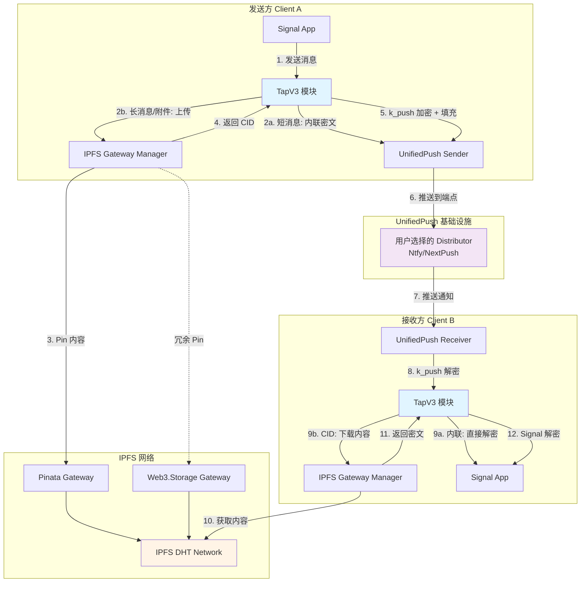

# Tap v3 (IPFS + UnifiedPush) 升级计划

app\src\main\java\org\thoughtcrime\securesms\tapv3

## 1. 项目概述

### 1.1 背景
Tap v2 模式依赖云厂商服务（AWS S3/Lambda、腾讯云 COS/SCF），虽然实现了消息传输的去中心化，但仍需要用户配置云服务账户，存在以下问题：
- 依赖中心化云服务提供商
- 需要用户配置复杂的云服务 API Key
- 云服务成本和配额限制
- 跨云厂商互通复杂

### 1.2 目标
Tap v3 进一步去中心化，使用 IPFS 替代云对象存储，使用 UnifiedPush 替代 API Gateway + Lambda，实现：
- ✅ 完全去中心化的消息传输
- ✅ 降低用户配置成本（无需云服务账户）
- ✅ 更低的使用成本（IPFS pinning 服务有较大免费额度）
- ✅ 增强隐私保护（多层加密）

### 1.3 核心特性
1. **IPFS 存储**: 使用 IPFS 存储消息密文和附件，支持多 gateway 冗余
2. **UnifiedPush 推送**: 使用去中心化推送协议，用户可自选推送提供商
3. **多层加密**: Signal E2EE + k_push 对称加密，深度防御
4. **智能路由**: 短消息内联传输，长消息和附件通过 IPFS CID 引用
5. **流量优化**: 无填充设计，最小化网络开销

### 1.4 约束与边界
- **私聊优先**: v3 初期只实现私聊功能，不支持群聊
- **独立模块**: 新建 `tapv3` 模块，与 v2 完全独立，不共享代码
- **模式互斥**: v2 和 v3 模式不能互通，用户需选择一种模式
- **单一端点**: 每个用户只有一个全局 UnifiedPush 端点，接收所有 v3 消息

---

## 2. 系统架构

### 2.1 架构图



### 2.2 数据流详解

#### 2.2.1 短消息发送流程（内联模式）
```
用户输入 "Hello" (明文 < 2KB)
  ↓
Signal 协议加密 → 密文 (~200 bytes)
  ↓
序列化为 TapV3Payload.Inline
  ↓
k_push AES-GCM 加密 → 密文 (~230 bytes)
  ↓
Base64 编码 → (~310 chars)
  ↓
UnifiedPush 发送到接收方端点
  ↓
接收方解码 → k_push 解密 → Signal 解密 → 显示
```

#### 2.2.2 长消息/附件发送流程（IPFS 模式）
```
用户发送长文本或附件
  ↓
Signal 协议加密 → 密文
  ↓
上传到 IPFS Gateway (Pinata + Web3.Storage)
  ↓
获得 CID: "QmXxxxxx..." (~46-59 bytes)
  ↓
构造 TapV3Payload.IpfsRefs { messageCid, attachmentCids }
  ↓
k_push AES-GCM 加密 → (~100-150 bytes)
  ↓
Base64 编码 → (~135-200 chars)
  ↓
UnifiedPush 发送
  ↓
接收方收到推送 → 解码 → k_push 解密 → 解析 CID
  ↓
从 IPFS 下载内容 → Signal 解密 → 显示
```

### 2.3 核心组件

| 模块 | 职责 | 关键类 |
|------|------|--------|
| **TapV3Manager** | v3 传输总控 | `TapV3TransportManager` |
| **IPFS 层** | 内容存储与检索 | `IpfsGatewayManager`, `PinataGateway`, `Web3StorageGateway` |
| **Push 层** | 推送通知 | `UnifiedPushProvider`, `PushEndpointManager` |
| **加密层** | k_push 管理 | `KPushManager`, `PaddingStrategy` |
| **协议层** | 握手与消息协议 | `TapV3HandshakeManager`, `TapV3MessageCodec` |
| **数据库层** | 状态持久化 | `TapV3ChannelTable`, `KPushKeyTable` |
| **UI 层** | 配置界面 | `TapV3ConfigActivity`, `TapV3StatusIndicator` |

---

## 3. 技术规格

### 3.1 IPFS 集成

#### 3.1.1 支持的 Gateway
- **Pinata**: 主要 gateway，1GB 免费额度，速度快
- **Web3.Storage**: 备用 gateway，更大免费额度，Filecoin 支持

#### 3.1.2 Gateway 选择策略
```
上传时:
  IF 消息大小 < 10MB AND Pinata 配额充足
    THEN 使用 Pinata
  ELSE
    使用 Web3.Storage

下载时:
  优先级列表: [Pinata, Web3.Storage]
  依次尝试，直到成功或全部失败
```

#### 3.1.3 内容生命周期
- **文本消息**: Pin 14 天，自动 unpin（节省配额）
- **附件**: Pin 30 天，或用户手动控制
- **清理策略**: 后台定期检查过期内容，批量 unpin

### 3.2 UnifiedPush 集成

#### 3.2.1 端点管理
- 每个用户注册**一个全局端点**
- 端点格式: `https://[distributor]/[token]`
- 端点在 v3 握手时交换并持久化

#### 3.2.2 消息格式
```json
{
  "type": 1,          // 1=Inline, 2=IpfsRefs
  "data": "base64..."  // k_push 加密后的填充数据
}
```

#### 3.2.3 大小限制
- 推送消息上限: 4096 bytes（UnifiedPush 推荐上限）
- 内联阈值: 2048 bytes（明文）
- 实际消息大小:
  - 短消息内联: ~200-500 bytes（加密后）
  - CID 引用: ~100-150 bytes（加密后）
  - 多附件 CID: ~200-500 bytes（加密后）

### 3.3 加密方案

#### 3.3.1 多层加密架构
```
Layer 1: Signal 协议 E2EE (已有)
  ↓
Layer 2: k_push AES-256-GCM 加密 (新增)
```

#### 3.3.2 k_push 密钥管理
- **生成**: 握手时生成 32 字节随机密钥
- **交换**: 通过 Signal 安全通道传输（类似 v2 Token 交换）
- **存储**: 加密存储在本地数据库
- **轮换**: v3 初期不实现自动轮换，保留接口

#### 3.3.3 流量优化
- **无填充设计**: 直接传输加密后的数据，不进行填充
- **优势**: 
  - CID 消息仅 ~100-150 bytes，相比填充节省 97% 流量
  - 短消息 ~200-500 bytes，节省 85-95% 流量
  - 降低 UnifiedPush 服务器负载
- **隐私考虑**: 
  - 虽然消息大小可被观察，但 k_push 加密保证内容安全
  - Signal 本身的加密已提供足够的隐私保护
  - 实际消息长度仍难以推断真实内容（压缩、附件引用等因素）

### 3.4 协议规格

#### 3.4.1 握手协议（v3 Handshake）
```kotlin
// 握手消息结构
{
  "version": 3,
  "unifiedPushEndpoint": "https://ntfy.sh/xxx",
  "k_push": [32 bytes],
  "keyVersion": 1,
  "ipfsGateways": ["pinata.cloud", "web3.storage"],
  "capabilities": ["inline", "ipfs", "multi-attachment"]
}
```

#### 3.4.2 消息负载协议
```kotlin
// Type 1: Inline (短消息)
{
  "type": 1,
  "encrypted": [Signal 加密的密文]
}

// Type 2: IpfsRefs (长消息/附件)
{
  "type": 2,
  "messageCid": "QmXxx...",  // 可选，null 表示无文本
  "attachments": [
    {
      "cid": "QmYyy...",
      "size": 1048576,
      "mimeType": "image/jpeg"
    }
  ]
}
```

---

## 4. 模块设计

### 4.1 目录结构

```
app/src/main/java/org/thoughtcrime/securesms/
├── tapv3/                          # v3 独立模块
│   ├── TapV3Manager.kt             # v3 总管理器（单例）
│   ├── TapV3TransportManager.kt    # 传输管理器
│   │
│   ├── ipfs/                       # IPFS 子模块
│   │   ├── IpfsGateway.kt          # Gateway 接口
│   │   ├── IpfsGatewayManager.kt   # Gateway 管理器
│   │   ├── PinataGateway.kt        # Pinata 实现
│   │   ├── Web3StorageGateway.kt   # Web3.Storage 实现
│   │   ├── IpfsContentManager.kt   # 内容生命周期管理
│   │   └── IpfsQuotaMonitor.kt     # 配额监控
│   │
│   ├── push/                       # UnifiedPush 子模块
│   │   ├── UnifiedPushProvider.kt  # UnifiedPush 实现
│   │   ├── PushEndpointManager.kt  # 端点管理
│   │   └── PushMessageHandler.kt   # 推送消息处理
│   │
  ├── crypto/                     # 加密子模块
  │   ├── KPushManager.kt         # k_push 密钥管理
  │   └── TapV3Crypto.kt          # 加密工具类
│   │
│   ├── protocol/                   # 协议子模块
│   │   ├── TapV3HandshakeManager.kt    # 握手管理
│   │   ├── TapV3MessageCodec.kt        # 消息编解码
│   │   ├── TapV3Payload.kt             # 消息负载定义
│   │   └── TapV3ControlMessage.kt      # 控制消息
│   │
│   ├── database/                   # 数据库子模块
│   │   ├── TapV3ChannelTable.kt    # v3 通道表
│   │   ├── KPushKeyTable.kt        # k_push 密钥表
│   │   └── IpfsContentTable.kt     # IPFS 内容跟踪表
│   │
│   ├── integration/                # Signal 集成层
│   │   ├── TapV3SendIntegrator.kt      # 发送集成
│   │   ├── TapV3ReceiveIntegrator.kt   # 接收集成
│   │   └── TapV3MessageRouter.kt       # 消息路由
│   │
│   ├── ui/                         # UI 层
│   │   ├── TapV3ConfigActivity.kt      # v3 配置界面
│   │   ├── TapV3HandshakeDialog.kt     # 握手对话框
│   │   └── TapV3StatusIndicator.kt     # v3 状态指示器
│   │
│   └── utils/                      # 工具类
│       ├── TapV3Logger.kt          # 日志工具
│       ├── TapV3Constants.kt       # 常量定义
│       └── TapV3Validator.kt       # 数据验证
```

### 4.2 数据库设计

#### 4.2.1 tap_v3_channels 表
```sql
CREATE TABLE tap_v3_channels (
  _id INTEGER PRIMARY KEY AUTOINCREMENT,
  recipient_id TEXT NOT NULL UNIQUE,
  status TEXT NOT NULL,                    -- PENDING, ACTIVE, FAILED
  push_endpoint TEXT NOT NULL,             -- 对方的 UnifiedPush 端点
  k_push BLOB NOT NULL,                    -- k_push 密钥（加密存储）
  key_version INTEGER DEFAULT 1,
  ipfs_gateways TEXT,                      -- JSON 数组
  created_at INTEGER NOT NULL,
  updated_at INTEGER NOT NULL
);
```

#### 4.2.2 tap_v3_kpush_keys 表
```sql
CREATE TABLE tap_v3_kpush_keys (
  _id INTEGER PRIMARY KEY AUTOINCREMENT,
  recipient_id TEXT NOT NULL,
  key_version INTEGER NOT NULL,
  key_data BLOB NOT NULL,                  -- 加密的密钥
  created_at INTEGER NOT NULL,
  expires_at INTEGER,                      -- 预留：未来支持轮换
  is_active INTEGER DEFAULT 1,
  UNIQUE(recipient_id, key_version)
);
```

#### 4.2.3 tap_v3_ipfs_content 表
```sql
CREATE TABLE tap_v3_ipfs_content (
  _id INTEGER PRIMARY KEY AUTOINCREMENT,
  cid TEXT NOT NULL UNIQUE,
  content_type TEXT,                       -- message, attachment
  size_bytes INTEGER,
  gateway TEXT,                            -- pinata, web3storage
  pinned_at INTEGER NOT NULL,
  expires_at INTEGER,                      -- 预期过期时间
  recipient_id TEXT,                       -- 关联的联系人（可选）
  message_id TEXT                          -- 关联的消息 ID（可选）
);
```

---

## 5. 实现计划

### Phase 1: 基础设施搭建（1-2 周）

#### 目标
建立 v3 模块基础框架，实现 IPFS 和 UnifiedPush 基础能力。

#### 任务清单
- [ ] **模块初始化**
  - [ ] 创建 `tapv3` 目录结构
  - [ ] 定义核心接口和数据类
  - [ ] 创建数据库表和 DAO

- [ ] **IPFS 集成**
  - [ ] 实现 `IpfsGateway` 接口
  - [ ] 集成 Pinata SDK/API
  - [ ] 集成 Web3.Storage SDK/API
  - [ ] 实现 `IpfsGatewayManager` 故障切换逻辑
  - [ ] 单元测试：上传、下载、CID 验证

- [ ] **UnifiedPush 集成**
  - [ ] 集成 UnifiedPush Android SDK
  - [ ] 实现端点注册和管理
  - [ ] 实现推送消息接收器
  - [ ] 单元测试：端点生成、消息收发

- [ ] **加密层实现**
  - [ ] 实现 k_push 生成和存储
  - [ ] 实现 AES-256-GCM 加密/解密
  - [ ] 单元测试：加密往返、密文大小验证

#### 验收标准
- ✅ 能够上传数据到 Pinata 并获得 CID
- ✅ 能够通过 CID 从 IPFS 下载数据
- ✅ 能够注册 UnifiedPush 端点
- ✅ 能够接收 UnifiedPush 推送消息
- ✅ k_push 加密/解密测试通过
- ✅ 推送消息大小符合预期（无浪费）

---

### Phase 2: 协议层实现（1-2 周）

#### 目标
实现 v3 握手协议和消息编解码。

#### 任务清单
- [ ] **握手协议**
  - [ ] 定义 `TapV3HandshakeMessage` 数据结构
  - [ ] 实现握手发起逻辑
  - [ ] 实现握手响应逻辑
  - [ ] 通过 Signal 安全通道传输握手消息
  - [ ] 握手成功后建立 v3 通道

- [ ] **消息协议**
  - [ ] 定义 `TapV3Payload` 数据结构（Inline 和 IpfsRefs）
  - [ ] 实现消息序列化/反序列化
  - [ ] 实现内联阈值判断逻辑（2KB）
  - [ ] 实现 Base64 编码/解码

- [ ] **消息路由**
  - [ ] 实现发送时的路由决策（内联 vs IPFS）
  - [ ] 实现接收时的消息分发（内联 vs CID）
  - [ ] 错误处理和重试机制

#### 验收标准
- ✅ 两个客户端能够完成 v3 握手
- ✅ 握手后能够查询对方的端点和 k_push
- ✅ 能够正确序列化和反序列化 v3 消息
- ✅ 能够根据消息大小自动选择传输方式

---

### Phase 3: 端到端消息传输（2-3 周）

#### 目标
实现完整的发送和接收流程。

#### 任务清单
- [ ] **发送流程**
  - [ ] 集成到 `IndividualSendJob`（参考 v2）
  - [ ] 实现短消息内联发送
  - [ ] 实现长消息 IPFS 上传 + CID 发送
  - [ ] 实现附件上传到 IPFS
  - [ ] 发送失败重试逻辑

- [ ] **接收流程**
  - [ ] 实现 UnifiedPush 消息接收
  - [ ] k_push 解密和去填充
  - [ ] 内联消息直接解密显示
  - [ ] CID 消息从 IPFS 下载后解密
  - [ ] 集成到 Signal 消息处理流程

- [ ] **附件处理**
  - [ ] 附件上传到 IPFS 并获取 CID
  - [ ] 附件下载和缓存策略
  - [ ] 附件进度显示
  - [ ] 附件预览支持

#### 验收标准
- ✅ 能够发送短文本消息（< 2KB）并实时接收
- ✅ 能够发送长文本消息（> 2KB）并正确接收
- ✅ 能够发送图片附件并正确接收和显示
- ✅ 能够发送视频/文件附件并正确下载
- ✅ 消息延迟在可接受范围（< 5 秒）

---

### Phase 4: UI 和用户体验（1-2 周）

#### 目标
实现 v3 配置界面和状态指示。

#### 任务清单
- [ ] **配置界面**
  - [ ] 创建 `TapV3ConfigActivity`
  - [ ] IPFS Gateway 配置（Pinata API Key, Web3.Storage Token）
  - [ ] UnifiedPush Distributor 选择和配置
  - [ ] v3 通道列表和状态展示
  - [ ] 配置测试功能（验证 API Key 有效性）

- [ ] **握手 UI**
  - [ ] v3 握手发起按钮（联系人详情页）
  - [ ] 握手进度对话框
  - [ ] 握手成功/失败提示

- [ ] **状态指示**
  - [ ] 对话列表 v3 模式标识（类似 v2 的 "v2" 标签）
  - [ ] 消息详情页显示传输方式（内联/IPFS）
  - [ ] IPFS 下载进度条

- [ ] **设置集成**
  - [ ] 在 Signal 设置中添加 "Tap v3" 入口
  - [ ] 与 v2 设置分离（不同页面）

#### 验收标准
- ✅ 用户能够配置 IPFS Gateway 凭证
- ✅ 用户能够选择 UnifiedPush Distributor
- ✅ 用户能够发起 v3 握手并看到状态
- ✅ 对话列表正确显示 v3 标识
- ✅ 消息发送/接收状态清晰可见

---

### Phase 5: 测试和优化（1-2 周）

#### 目标
全面测试和性能优化。

#### 任务清单
- [ ] **功能测试**
  - [ ] 端到端消息测试（文本、图片、视频、文件）
  - [ ] 离线消息测试（接收方离线时的行为）
  - [ ] 网络切换测试（WiFi ↔ 移动网络）
  - [ ] 边界条件测试（2KB 阈值边界、大文件、空消息）

- [ ] **安全测试**
  - [ ] k_push 加密正确性验证
  - [ ] 填充防流量分析验证
  - [ ] 密钥存储安全性检查
  - [ ] 中间人攻击防护验证

- [ ] **性能优化**
  - [ ] IPFS 下载速度优化（并行下载、缓存）
  - [ ] 电池使用优化（减少后台轮询）
  - [ ] 内存使用优化（大文件流式处理）
  - [ ] 网络流量优化（压缩、去重）

- [ ] **监控和日志**
  - [ ] 关键操作日志记录
  - [ ] 性能指标收集（延迟、成功率）
  - [ ] 错误报告和诊断工具

#### 验收标准
- ✅ 所有功能测试用例通过
- ✅ 安全审计无严重问题
- ✅ 消息延迟 P50 < 2 秒，P95 < 5 秒
- ✅ 无内存泄漏和 ANR
- ✅ 完善的错误处理和用户提示

---

## 6. TODO List（开发检查清单）

### 6.1 核心功能
- [ ] IPFS Gateway 集成（Pinata + Web3.Storage）
- [ ] UnifiedPush SDK 集成
- [ ] k_push 密钥生成和管理
- [ ] AES-256-GCM 加密实现
- [ ] v3 握手协议实现
- [ ] 消息编解码实现
- [ ] 内联消息发送/接收
- [ ] IPFS CID 消息发送/接收
- [ ] 附件上传/下载

### 6.2 数据层
- [ ] 创建 `tap_v3_channels` 表
- [ ] 创建 `tap_v3_kpush_keys` 表
- [ ] 创建 `tap_v3_ipfs_content` 表
- [ ] 实现 DAO 和查询接口
- [ ] 数据库迁移脚本

### 6.3 集成层
- [ ] 集成到 `IndividualSendJob`
- [ ] 集成到消息接收流程
- [ ] 集成到附件处理流程
- [ ] v3 模式路由决策

### 6.4 UI 层
- [ ] v3 配置界面
- [ ] 握手 UI 流程
- [ ] v3 状态指示器
- [ ] 消息传输进度显示

### 6.5 测试
- [ ] 单元测试（加密、编解码、Gateway）
- [ ] 集成测试（端到端消息）
- [ ] UI 测试（配置流程、握手流程）
- [ ] 性能测试（延迟、吞吐量）

### 6.6 文档
- [ ] API 文档
- [ ] 用户使用手册
- [ ] 开发者集成指南
- [ ] 故障排查文档

---

## 7. 风险与缓解

### 7.1 技术风险

| 风险 | 影响 | 概率 | 缓解措施 |
|------|------|------|----------|
| **IPFS 下载速度慢** | 消息延迟高 | 中 | 双 Gateway 冗余、本地缓存、预加载 |
| **UnifiedPush 可靠性** | 消息丢失 | 中 | 推送失败降级方案、客户端主动同步 |
| **k_push 密钥丢失** | 无法解密消息 | 低 | 密钥备份机制、密钥恢复流程 |
| **UnifiedPush 大小限制** | 大消息无法内联 | 低 | 自动降级到 IPFS，智能阈值调整 |
| **IPFS Gateway 配额耗尽** | 无法发送消息 | 中 | 配额监控、自动切换 Gateway、用户提醒 |

### 7.2 用户体验风险

| 风险 | 影响 | 概率 | 缓解措施 |
|------|------|------|----------|
| **配置复杂** | 用户放弃使用 | 高 | 提供默认配置、简化 UI、引导流程 |
| **消息延迟感知** | 用户体验差 | 中 | 优化 IPFS 速度、显示进度、预加载 |
| **离线消息处理** | 消息丢失感知 | 中 | 明确的离线提示、自动同步机制 |
| **存储空间占用** | 设备空间不足 | 低 | 自动清理策略、用户可控制缓存大小 |

### 7.3 安全风险

| 风险 | 影响 | 概率 | 缓解措施 |
|------|------|------|----------|
| **k_push 泄露** | 历史消息泄露 | 低 | 加密存储、定期轮换（未来）、权限控制 |
| **UnifiedPush 中间人** | 推送拦截 | 低 | k_push 加密、消息认证 |
| **IPFS 内容探测** | 隐私泄露 | 极低 | Signal E2EE 保护、CID 无意义 |
| **消息大小泄露** | 可观察消息长度 | 低 | k_push 加密已足够、Signal E2EE 主保护层 |

---

## 8. 成功指标

### 8.1 功能指标
- ✅ v3 握手成功率 > 95%
- ✅ 消息发送成功率 > 99%
- ✅ 消息接收成功率 > 99%
- ✅ 附件上传成功率 > 98%

### 8.2 性能指标
- ✅ 短消息端到端延迟 P50 < 2 秒
- ✅ 短消息端到端延迟 P95 < 5 秒
- ✅ 长消息端到端延迟 P50 < 5 秒
- ✅ 长消息端到端延迟 P95 < 10 秒
- ✅ IPFS 下载速度 > 1 MB/s (WiFi)

### 8.3 用户体验指标
- ✅ 配置完成率 > 80%
- ✅ v3 握手放弃率 < 20%
- ✅ 用户满意度 > 4.0/5.0

### 8.4 成本指标
- ✅ 单用户月均 IPFS 成本 < $0.10
- ✅ Pinata 免费额度覆盖率 > 90% 用户

---

## 9. 后续规划

### 9.1 短期优化（v3.1）
- [ ] k_push 自动轮换机制
- [ ] IPFS 内容自动清理优化
- [ ] 离线消息同步优化
- [ ] 更多 IPFS Gateway 支持（NFT.Storage 等）

### 9.2 中期扩展（v3.2）
- [ ] 群聊支持
- [ ] v2 和 v3 互通（协议协商）
- [ ] 其他 Push 方式支持（XMPP、Matrix）
- [ ] 自托管 IPFS 节点支持

### 9.3 长期愿景（v4.0）
- [ ] 完全 P2P 通信（无需 Push 服务）
- [ ] WebRTC 实时通信
- [ ] 区块链身份验证
- [ ] 端到端审计日志

---

## 10. 参考资源

### 10.1 技术文档
- [IPFS Documentation](https://docs.ipfs.tech/)
- [Pinata API Documentation](https://docs.pinata.cloud/)
- [Web3.Storage Documentation](https://web3.storage/docs/)
- [UnifiedPush Documentation](https://unifiedpush.org/developers/intro/)
- [Signal Protocol Specification](https://signal.org/docs/)

### 10.2 相关项目
- [java-ipfs-http-client](https://github.com/ipfs/java-ipfs-http-client)
- [UnifiedPush Android SDK](https://github.com/UnifiedPush/android-connector)
- [Signal Android](https://github.com/signalapp/Signal-Android)

### 10.3 内部文档
- [Tap v2 架构文档](./Arch.md)
- [Tap v2 WebSocket 改造方案](./PLAN_Websocket.md)
- [Tap v3 握手协议草案](./docs/PLAN_TapHandshakeV3.md)
- [Tap 模块架构概览](./app/src/main/java/org/thoughtcrime/securesms/tap/ARCHITECTURE_OVERVIEW.md)

---

## 附录 A: 关键配置参数

```kotlin
object TapV3Constants {
    // 消息大小
    const val INLINE_THRESHOLD_BYTES = 2048          // 2KB 明文阈值
    const val PUSH_MESSAGE_MAX_SIZE = 4096           // 推送消息上限（UnifiedPush）
    const val MAX_ATTACHMENT_SIZE = 100 * 1024 * 1024 // 100MB 附件上限
    
    // IPFS 配置
    const val IPFS_PIN_DURATION_DAYS_MESSAGE = 14    // 消息 Pin 14 天
    const val IPFS_PIN_DURATION_DAYS_ATTACHMENT = 30 // 附件 Pin 30 天
    const val IPFS_DOWNLOAD_TIMEOUT_MS = 30000       // 下载超时 30 秒
    const val IPFS_UPLOAD_TIMEOUT_MS = 60000         // 上传超时 60 秒
    
    // k_push 配置
    const val KPUSH_KEY_SIZE_BYTES = 32              // 256-bit 密钥
    const val KPUSH_KEY_VERSION_INITIAL = 1          // 初始版本号
    
    // 重试策略
    const val MAX_SEND_RETRIES = 3                   // 最大重试次数
    const val RETRY_BACKOFF_MS = 2000                // 重试退避 2 秒
    
    // 缓存配置
    const val IPFS_CACHE_SIZE_MB = 100               // IPFS 缓存 100MB
    const val IPFS_CACHE_MAX_AGE_DAYS = 7            // 缓存最长保留 7 天
}
```

---

## 附录 B: 版本兼容性

| 功能 | v2 | v3 | 备注 |
|------|----|----|------|
| 云对象存储 | ✅ | ❌ | v3 使用 IPFS |
| Lambda/SCF | ✅ | ❌ | v3 使用 UnifiedPush |
| API Gateway | ✅ | ❌ | v3 使用 UnifiedPush |
| WebSocket | ✅ | ❌ | v3 依赖 UnifiedPush 推送 |
| 子账户交换 | ✅ | ❌ | v3 交换 k_push |
| 离线轮询 | ✅ | ⚠️ | v3 依赖 UnifiedPush，离线依赖 distributor |
| 群聊 | ✅ | ❌ | v3 初期不支持 |
| 跨模式通信 | - | ❌ | v2 和 v3 不互通 |

---

**文档版本**: v1.0  
**最后更新**: 2025年12月1日  
**负责人**: Tap v3 开发团队  
**状态**: ✅ 待审批 → 开发实施
