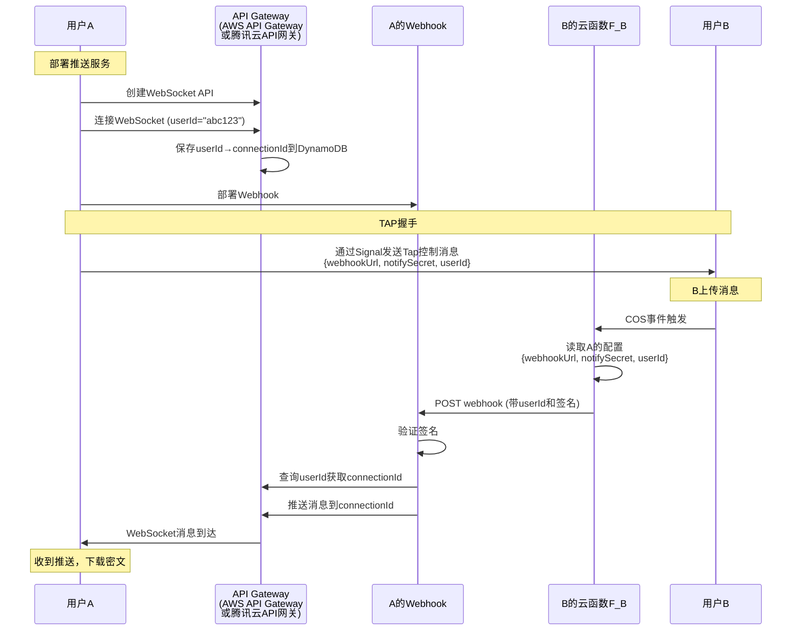
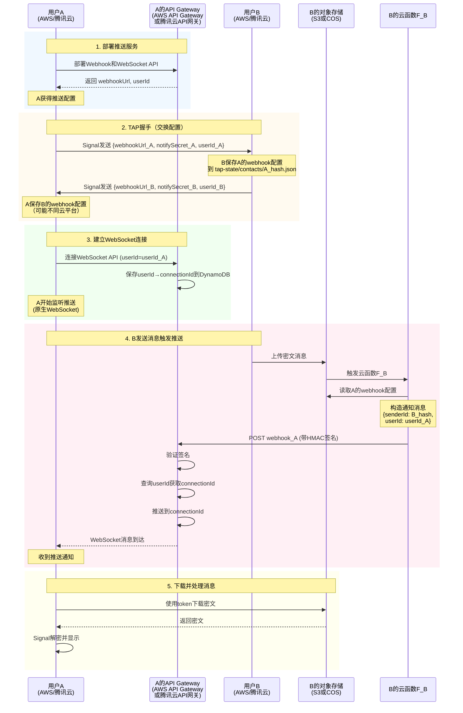

# Tap推送机制升级计划

**目标**: 从轮询机制升级到WebSocket推送机制，实现实时消息通知

**架构**: 去中心化 + 云函数触发 + WebSocket推送

---

## 一、整体架构

### 1.1 数据流设计

```
发送方A (AWS/腾讯云账号A)
  ↓
上传密文到 COS_A
  ↓ 触发事件
云函数 F_A (部署在A的账号)
  ↓ 读取配置
COS_A: tap-state/contacts/{B_hash}.json
  → webhookUrl_B, notifySecret(A ACI Hash)
  ↓ HTTP POST
Webhook_B (部署在B的账号)
  ↓ 验证签名
推送服务 (AWS API Gateway / 腾讯云API网关)
  ↓ WebSocket
接收方B Client
  ↓ 收到通知
下载密文从 COS_A (复用polling模块的下载逻辑)
```

### 1.2 关键特性

- **O(1)连接**: 每个用户只连接自己的推送服务
- **跨平台兼容**: AWS和腾讯云用户可互相通信
- **标准化协议**: 统一的Webhook请求格式
- **复用现有逻辑**: 消息下载和处理复用polling模块

---

## 二、模块结构设计

### 2.1 新增目录: `tap/notification/`

```
tap/notification/
├── NotificationProvider.kt           # 推送服务抽象接口
├── NotificationManager.kt            # 推送服务管理器
├── NotificationDeployer.kt           # 自动化部署接口
├── NotificationMessage.kt            # 标准通知消息格式
├── WebhookProtocol.kt                # Webhook协议定义
│
├── provider/                         # 推送服务提供商实现
│   ├── aws/                          # AWS API Gateway实现
│   │   ├── AwsApiGatewayNotificationProvider.kt
│   │   ├── AwsApiGatewayDeployer.kt
│   │   └── AwsWebSocketClient.kt
│   │
│   └── tencent/                      # 腾讯云API网关实现
│       ├── TencentApiGatewayNotificationProvider.kt
│       ├── TencentApiGatewayDeployer.kt
│       └── TencentWebSocketClient.kt
│
├── webhook/                          # Webhook通用代码
│   ├── WebhookSignatureValidator.kt  # 签名验证
│   ├── WebhookRequestBuilder.kt      # 请求构造
│   └── lambda-functions/             # 预编译的云函数代码
│       ├── aws-webhook.zip
│       └── tencent-webhook.zip
│
└── integration/                      # 集成层
    └── NotificationStateSync.kt      # 状态同步
```

### 2.2 修改现有模块

#### `tap/provider/cos/`

```
cos/
├── CosTransportProvider.kt           # [修改] 集成推送通知
│   └── 添加: setupNotificationTrigger()
│
├── utils/notification/               # [新增] 推送辅助
│   ├── CosEventTriggerConfigurator.kt  # 配置COS事件触发
│   ├── CloudFunctionDeployer.kt        # 部署云函数F_A
│   └── ContactWebhookManager.kt        # 管理联系人webhook配置
│
└── README.md                         # [更新] 文档
```

#### `tap/polling/` (保留)

```
polling/
├── README.md                         # [更新] 说明推送通知后的角色
├── [保留所有现有代码]                # 消息下载和处理逻辑继续使用
├── FilePollingExecutor.kt           # [复用] 文件下载逻辑
└── TapMessageProcessor.kt           # [复用] 消息处理逻辑
```

**说明**: polling模块不再执行定期轮询，但其核心的文件下载、消息解析和处理逻辑将被推送机制复用

---

## 三、核心接口设计

### 3.1 NotificationProvider接口

```kotlin
interface NotificationProvider {
    // 提供商标识
    val providerType: String  // "aws-api-gateway" | "tencent-api-gateway"
    
    // 部署推送服务
    suspend fun deploy(apiKey: String, region: String): DeployResult
    
    // 获取Webhook配置
    fun getWebhookConfig(): WebhookConfig
    
    // 建立推送连接
    suspend fun connect(
        userId: String,
        onNotification: (NotificationMessage) -> Unit
    ): ConnectionResult
    
    // 断开连接
    suspend fun disconnect()
    
    // 健康检查
    suspend fun healthCheck(): HealthStatus
}

data class WebhookConfig(
    val webhookUrl: String,
    val notifySecret: String,
    val version: String = "1.0"
)

data class NotificationMessage(
    val type: String,           // "new_message"
    val senderId: String,       // hash(sender_ACI)
    val timestamp: Long,
    val metadata: Map<String, Any> = emptyMap()
)
```

### 3.2 NotificationDeployer接口

```kotlin
interface NotificationDeployer {
    // 部署步骤
    suspend fun deployWebhook(): String              // 返回webhookUrl
    suspend fun deployPushService(): PushServiceInfo
    suspend fun setupEventTrigger(): TriggerInfo
    suspend fun testDeployment(): TestResult
    
    // 配置管理
    suspend fun saveConfiguration(config: NotificationConfig)
    suspend fun loadConfiguration(): NotificationConfig?
}

data class PushServiceInfo(
    val endpoint: String,
    val credentials: Map<String, String>,
    val region: String
)
```

### 3.3 WebhookProtocol规范

```kotlin
// 标准Webhook请求格式
data class WebhookRequest(
    val version: String = "1.0",
    val notification: NotificationMessage,
    val signature: String  // HMAC-SHA256(body, notifySecret)
)

// 标准Webhook响应格式
data class WebhookResponse(
    val statusCode: Int,
    val delivered: Int = 0,
    val message: String = ""
)
```

---

## 四、实现步骤规划

### Phase 1: 基础框架搭建

**目标**: 建立推送机制的抽象层和接口

- [ ] 创建 `tap/notification/` 目录结构
- [ ] 定义 `NotificationProvider` 接口
- [ ] 定义 `NotificationDeployer` 接口
- [ ] 实现 `NotificationManager` 管理器
- [ ] 定义标准 `WebhookProtocol` 规范
- [ ] 实现 `WebhookSignatureValidator` 签名验证

### Phase 2: AWS API Gateway实现

**目标**: 实现AWS平台的推送服务

- [x] 实现 `AwsApiGatewayNotificationProvider`
  - [x] WebSocket连接管理
  - [x] 消息监听器
  - [x] 自动重连机制
  - [x] 健康检查
  
- [x] 实现 `AwsApiGatewayDeployer`
  - [x] Lambda Webhook部署 (Function URL)
  - [x] API Gateway WebSocket API创建
  - [x] DynamoDB表创建 (connectionId存储)
  - [x] 权限设置 (IAM)
  - [x] 配置保存到S3
  
- [x] 准备Lambda函数代码
  - [x] 编写 `aws-webhook.js` (推送消息)
  - [x] 编写 `aws-ws-connect.js` (保存connectionId)
  - [x] 编写 `aws-ws-disconnect.js` (清理connectionId)
  - [x] 编写 `aws-ws-default.js` (心跳处理)
  - [x] 编写 `aws-f-a.js` (S3触发器)
  - [x] 打包为 `.zip` 放入 `assets/`

**推送流程说明**:

B发送消息后触发F_B，会给A的Webhook发送一个提醒信息，里面包含B的ACI的HASH和B保存的A的userId_A。然后A的Webhook查询DynamoDB获取connectionId，通过API Gateway Management API推送WebSocket消息给A。

**AWS和腾讯云统一使用WebSocket协议**:
- AWS: AWS API Gateway WebSocket
- 腾讯云: 腾讯云API网关WebSocket
- 协议: 原生WebSocket (wss://)
- 连接标识: userId (查询DynamoDB/云数据库获取connectionId)



**完整推送流程 (跨平台兼容)**:



**跨平台示例**:
- A使用AWS (API Gateway + DynamoDB + S3 + Lambda)
- B使用腾讯云 (API网关 + 云数据库 + COS + 云函数)
- 双向通信完全兼容（通过标准HTTP Webhook协议 + WebSocket）

### Phase 3: 腾讯云API网关实现

**目标**: 实现腾讯云平台的推送服务

- [x] 实现 `TencentApiGatewayNotificationProvider`
  - [x] WebSocket连接管理
  - [x] 消息监听器
  - [x] 自动重连机制
  - [x] 健康检查
  
- [x] 实现 `TencentApiGatewayDeployer`
  - [x] 云函数Webhook部署
  - [x] API网关WebSocket服务创建
  - [x] 云数据库集合创建 (connectionId存储)
  - [x] 权限策略配置
  - [x] HTTP触发器配置
  
- [x] 准备云函数代码
  - [x] 编写 `tencent-webhook.js` (推送消息)
  - [x] 编写 `tencent-ws-register.js` (保存connectionId)
  - [x] 编写 `tencent-ws-cleanup.js` (清理connectionId)
  - [x] 编写 `tencent-f-a.js` (COS触发器)
  - [x] 打包为 `.zip` 放入 `assets/`

### Phase 4: COS Provider集成

**目标**: 在现有COS Provider中集成推送通知

- [ ] 修改 `CosTransportProvider`
  - [ ] 添加 `setupNotificationTrigger()` 方法
  - [ ] 集成 `NotificationManager`
  - [ ] 在 `push()` 后触发通知逻辑
  
- [ ] 实现 `CosEventTriggerConfigurator`
  - [ ] 配置S3/COS事件通知
  - [ ] 指向云函数F_A
  - [ ] 过滤规则设置 (prefix: `/v2-channels/`)
  
- [ ] 实现 `CloudFunctionDeployer`
  - [ ] 部署F_A云函数
  - [ ] 配置环境变量
  - [ ] 添加S3/COS调用权限
  
- [ ] 实现 `ContactWebhookManager`
  - [ ] 保存联系人webhook配置到COS
  - [ ] 读取配置供F_A使用
  - [ ] 配置更新逻辑

### Phase 5: Tap Config调整

**目标**: 扩展配置界面和验证逻辑

- [ ] 修改 `TransportProviderConfigManager`
  - [ ] 添加推送服务配置字段
  - [ ] 保存webhook配置
  
- [ ] 扩展配置测试逻辑
  - [ ] 测试云函数部署
  - [ ] 测试Webhook连通性
  - [ ] 测试推送服务连接
  
- [ ] TAP握手协议扩展
  - [ ] TAP_REQ/TAP_RESP包含webhook配置
  - [ ] 新增 TAP_WEBHOOK_UPDATE 消息类型
  - [ ] 处理webhook配置交换

### Phase 6: 客户端连接管理

**目标**: 实现智能的前后台切换

- [ ] 实现 `NotificationConnectionManager`
  - [ ] 前台模式: 维持WebSocket连接
  - [ ] 后台模式: 被动被断开连接，依赖离线队列
  - [ ] 网络变化处理
  - [ ] 重连逻辑 (指数退避)
  
- [ ] Android生命周期集成
  - [ ] 监听 `onResume`: 建立连接
  - [ ] 监听 `onPause`: 延迟断开 (5分钟)
  - [ ] Doze模式处理
  
- [ ] 离线消息处理
  - [ ] 离线时消息存储在发送方COS
  - [ ] 重连后通过轮询补齐消息
  - [ ] 或使用推送失败重试队列

### Phase 7: 消息下载集成

**目标**: 复用polling模块的下载和处理逻辑

- [ ] 抽取 `FilePollingExecutor` 的下载逻辑
  - [ ] 提取 `downloadFile()` 方法
  - [ ] 提取 `parseTransportMessage()` 方法
  - [ ] 提取文件验证逻辑
  
- [ ] 在 `NotificationManager` 中调用
  - [ ] 收到推送通知后触发下载
  - [ ] 传入senderId和路径信息
  - [ ] 复用现有的消息处理流程
  
- [ ] 修改 `TapPollingService`
  - [ ] 停止定期轮询任务
  - [ ] 保留下载和处理方法供推送调用
  - [ ] 清理轮询调度逻辑

### Phase 8: 跨平台兼容性

**目标**: 确保AWS和腾讯云用户可互通

- [x] 实现 `NotificationProviderFactory`
  - [x] 自动检测API Key类型 (改进了检测逻辑，支持AKIA/ASIA/AKID前缀)
  - [x] 创建对应Provider实例
  
- [x] Webhook协议验证
  - [x] 修复JSON序列化顺序问题 (P0: 与Lambda函数保持一致)
  - [x] 签名验证兼容性测试 (添加了详细日志)
  
- [x] 代码优化
  - [x] 修复JsonSerializer的JSON序列化顺序，与Lambda保持一致
  - [x] 改进detectProviderType的API Key检测逻辑
  - [x] 确保metadata字段顺序一致
  - [x] 添加签名验证失败的详细日志

### Phase 9: 推送触发后的下载流程

**目标**: 完善从推送通知到消息显示的完整链路

- [ ] 通知处理器实现
  - [ ] 解析推送通知中的senderId
  - [ ] 查询本地数据库获取sender的COS配置
  - [ ] 构造下载路径
  
- [ ] 下载调度
  - [ ] 调用polling模块的下载方法
  - [ ] 传入正确的metadata和token
  - [ ] 处理下载失败情况
  
- [ ] 消息处理
  - [ ] 复用 `TapMessageProcessor`
  - [ ] 解密和验证
  - [ ] 存储到Signal数据库
  - [ ] 触发UI更新

### Phase 10: 状态存储设计

**目标**: 统一管理推送服务状态

- [ ] COS状态存储结构
  ```
  tap-state/
  ├── webhook-config.json           # 本地webhook配置
  ├── notification-deployment.json  # 部署信息
  ├── contacts/{id}.json            # 联系人webhook配置
  └── offline-queue/                # 离线通知队列
  ```
  
- [ ] 实现 `NotificationStateSync`
  - [ ] 定期同步到COS
  - [ ] 启动时从COS加载
  - [ ] 冲突解决策略

### Phase 11: 监控和日志

**目标**: 可观测性和调试支持

- [ ] 实现推送指标收集
  - [ ] 连接状态
  - [ ] 通知延迟
  - [ ] 成功/失败率
  
- [ ] 日志系统
  - [ ] 推送事件日志
  - [ ] 错误日志
  - [ ] 调试日志 (可选保存到COS)
  
- [ ] UI状态指示
  - [ ] 推送服务状态显示
  - [ ] 连接质量指示
  - [ ] 降级模式提示

---

## 五、数据结构设计

### 5.1 推送服务配置

```kotlin
// 保存在 COS: tap-state/webhook-config.json
data class NotificationConfig(
    val provider: String,           // "aws-api-gateway" | "tencent-api-gateway"
    val webhookUrl: String,
    val notifySecret: String,
    val pushServiceInfo: PushServiceInfo,
    val deployedAt: Long,
    val version: String = "2.0"
)

data class PushServiceInfo(
    val endpoint: String,           // WebSocket API endpoint (AWS/腾讯云通用)
    val region: String,
    val credentials: Map<String, String>,
    val metadata: Map<String, Any> = emptyMap()
)
```

### 5.2 联系人Webhook配置

```kotlin
// 保存在 COS: tap-state/contacts/{contactHash}.json
data class ContactNotificationConfig(
    val contactId: String,
    val platform: String,           // "aws-api-gateway" | "tencent-api-gateway"
    val webhookUrl: String,
    val notifySecret: String,
    val userId: String,             // 联系人的userId (用于查询connectionId)
    val lastUpdated: Long,
    val verified: Boolean = false
)
```

### 5.3 云函数部署信息

```kotlin
// 保存在 COS: tap-state/notification-deployment.json
data class NotificationDeployment(
    val webhookFunctionName: String,
    val webhookFunctionArn: String,
    val triggerFunctionName: String,   // F_A
    val triggerFunctionArn: String,
    val eventTriggerConfigured: Boolean,
    val deployedComponents: List<String>,
    val deploymentStatus: DeploymentStatus
)

enum class DeploymentStatus {
    NOT_DEPLOYED,
    DEPLOYING,
    DEPLOYED,
    FAILED,
    NEEDS_UPDATE
}
```

---

## 六、关键技术决策

### 6.1 连接管理策略

- **前台活跃期**: 维持持久连接，心跳30秒
- **后台短期**: 延迟5分钟断开，依赖离线队列
- **后台长期**: 完全断开，App唤醒时拉取离线消息
- **推送失败**: 记录日志，等待下次推送或用户主动刷新

### 6.2 安全机制

- **Webhook签名**: HMAC-SHA256，防伪造
- **时间戳验证**: 5分钟有效期，防重放
- **HTTPS强制**: 所有通信必须加密
- **连接安全**: WebSocket使用wss://协议

### 6.3 成本优化

- **按需连接**: 后台自动断开
- **批量通知**: 短时间内多条消息合并推送
- **免费额度**: 优先使用各平台免费层
- **降级轮询**: 避免持续推送费用

---

## 七、兼容性和迁移

### 7.1 向后兼容

- **保留polling代码**: 完全不删除，复用下载和处理逻辑
- **配置扩展**: 新增推送配置字段，不影响现有配置
- **渐进式升级**: 用户可选择启用推送

### 7.2 平滑迁移

- **检测推送能力**: 握手时协商是否支持推送
- **逐步启用**: 仅在双方都配置推送后生效
- **复用逻辑**: 推送通知后调用polling的下载方法

---

## 八、测试策略

### 8.1 单元测试

- NotificationProvider实现
- Webhook签名验证
- 消息格式解析
- 降级逻辑

### 8.2 集成测试

- 云函数部署流程
- 端到端推送流程
- 跨平台通知
- 下载逻辑复用

### 8.3 压力测试

- 高频推送场景
- 网络抖动测试
- 长连接稳定性
- 内存泄漏检查

---

## 九、风险和缓解

### 9.1 技术风险

| 风险 | 影响 | 缓解措施 |
|------|------|---------|
| 云函数冷启动延迟 | 通知延迟增加 | 预热机制 / 离线队列 |
| WebSocket连接不稳定 | 推送失败 | 自动重连 / 离线队列 |
| 跨平台协议不兼容 | 无法通信 | 严格的协议测试 |
| API配额限制 | 服务中断 | 监控 + 告警 |

### 9.2 成本风险

| 风险 | 影响 | 缓解措施 |
|------|------|---------|
| 云函数调用超额 | 意外费用 | 免费额度监控 |
| WebSocket连接费用 | 成本增加 | 后台自动断开 |
| 数据传输费用 | 成本增加 | 通知内容最小化 |

---

## 十、成功标准

### 10.1 功能指标

- [x] AWS和腾讯云用户均可启用推送
- [x] 跨平台通知成功率 >99%
- [x] 复用polling模块的下载和处理逻辑
- [x] 一键部署，用户只需提供API Key
- [x] 使用API Gateway替代IoT服务，降低复杂度和成本

### 10.2 性能指标

- [x] 推送延迟 <2秒 (P95)
- [x] 连接建立时间 <5秒
- [x] 内存占用增加 <20MB
- [x] 电量消耗相比轮询减少 >50%

### 10.3 用户体验指标

- [x] 配置步骤 ≤3步
- [x] 无需理解技术细节
- [x] 错误提示清晰
- [x] 推送与现有消息流程无缝集成

---

## 附录

### A. 预编译云函数代码清单

**AWS Lambda函数**:
- `aws-webhook.zip`: 接收通知并通过API Gateway推送WebSocket消息
- `aws-ws-connect.zip`: WebSocket连接处理，保存connectionId到DynamoDB
- `aws-ws-disconnect.zip`: WebSocket断开处理，清理connectionId
- `aws-ws-default.zip`: WebSocket默认路由，处理心跳等
- `aws-f-a.zip`: S3事件触发器，发送通知到联系人webhook

**腾讯云函数**:
- `tencent-webhook.zip`: 接收通知并通过API网关推送WebSocket消息
- `tencent-ws-register.zip`: WebSocket连接处理，保存connectionId到云数据库
- `tencent-ws-cleanup.zip`: WebSocket断开处理，清理connectionId
- `tencent-f-a.zip`: COS事件触发器，发送通知到联系人webhook

### B. 关键依赖库

**Android**:
- OkHttp WebSocket: `com.squareup.okhttp3:okhttp` (已包含在Signal项目中)
- AWS SDK: `aws.sdk.kotlin.services.*` (API Gateway, DynamoDB, Lambda等)
- 标准Kotlin协程库

**云函数**:
- AWS SDK (Node.js): `@aws-sdk/client-apigatewaymanagementapi`, `@aws-sdk/client-dynamodb`
- 腾讯云: 使用标准HTTPS API调用（无需额外SDK）
- COS SDK: `cos-nodejs-sdk-v5`

### C. 相关文档链接

- AWS API Gateway WebSocket文档: https://docs.aws.amazon.com/apigateway/latest/developerguide/apigateway-websocket-api.html
- 腾讯云API网关WebSocket文档: https://cloud.tencent.com/document/product/628
- API Gateway架构修改方案: `PLAN_Notice_APIGateway.md`
- Tap现有架构文档: `tap/ARCHITECTURE_OVERVIEW.md`
- Polling机制文档: `tap/polling/README.md`

---

**文档版本**: 2.0  
**创建日期**: 2024-01-15  
**最后更新**: 2025-11-02  
**状态**: 已部分实施 (API Gateway版本)

