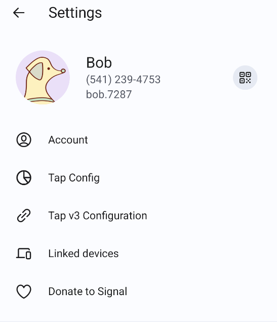

# TapSignal
[中文](README_CN.md) | [English](README.md)

---

TapSignal是一个[Signal](https://github.com/signalapp/Signal-Android)的分叉项目. 提供一种Tap模式,允许用户和好友将所有的消息通过新建立的通道而不是Signal Server进行传递.

## Introduction
---
TapSignal目前支持两种模式:

- v2: 基于aws的云服务
我们基于aws的S3, lambda函数和api gateway服务,实现了一个去中心化的Signal Server服务. 简单来说,通过lambda函数进行发送消息,api gateway实现接收消息,通过S3进行附件和离线消息的存储. 从而重现了Signal Server在消息传递时的功能.

- v3: 基于UnifiedPush和IPFS
我们借助UnifiedPush直接进行短消息的传递. 对于长消息和附件消息,先上传到IPFS获取cid,然后通过UnifiedPush传递cid. 对于离线消息,借助UnifiedPush本身提供的消息队列实现.

目前v3模式的私聊已经完成,群聊支持还在实现中.

## Download
---
目前你可以在Github的Releases 界面获取apk文件进行安装

## Usage
---
两个模式都需要在设置中配置一些服务,v2 mode在"Tap Config"界面配置,v3 mode在"Tap v3 Configuration"配置

### v2 mode
目前v2 mode只支持aws的服务,tencent的支持还待实现

对于v2 mode,我们需要: 
1. 创建一个aws S3的bucket
2. 获取一个aws的AccessKey

你首先需要在aws控制台创建一个新的S3 bucket,记住bucket的名称和存储区域(us-west-1之类)
然后你需要获取一个aws的AccessKey供app调用.这里你可以:

a. 直接使用一个有所有权限的访问密钥. 你可以在aws控制台点击你的用户名,选择"安全凭证",然后建立一个AccessKey,将这个AccessKey输入到app中.

b. 建立一个最小权限的AccessKey:
你可以在aws的CloudFormation 服务,通过我们提供的模板[tap-iam-cloudformation](./tap-iam-cloudformation.yaml)来建立一个满足app需求的最小权限凭证.
(1). 在aws控制台进入CloudFormation 服务;
(2). 点击 "Create Stack" → "With new resources";
(3). 上传此模板文件,填写参数(刚刚创建的S3 bucket的信息)
(4). 等待部署完成
(5). 在 Outputs 标签页复制 AccessKeyId 和 SecretAccessKey
(6). 在app中配置这个AccessKey的信息

在v2 mode的配置界面,注意要点击"部署推送服务"的选项,这里需要进行几分钟的部署,在这段时间不要退出.

### v3 mode
对于v3 mode,我们需要:一个UnifiedPush的Distributor, 一个pinata或web3.storage的api key.(也可以两个都配置)

对于UnifiedPush的Distributor,推荐使用[ntfy](https://unifiedpush.org/users/distributors/ntfy/)和[NextPush](https://unifiedpush.org/users/distributors/nextpush/)
暂不支持Sunup,还有一些bug正在修复

