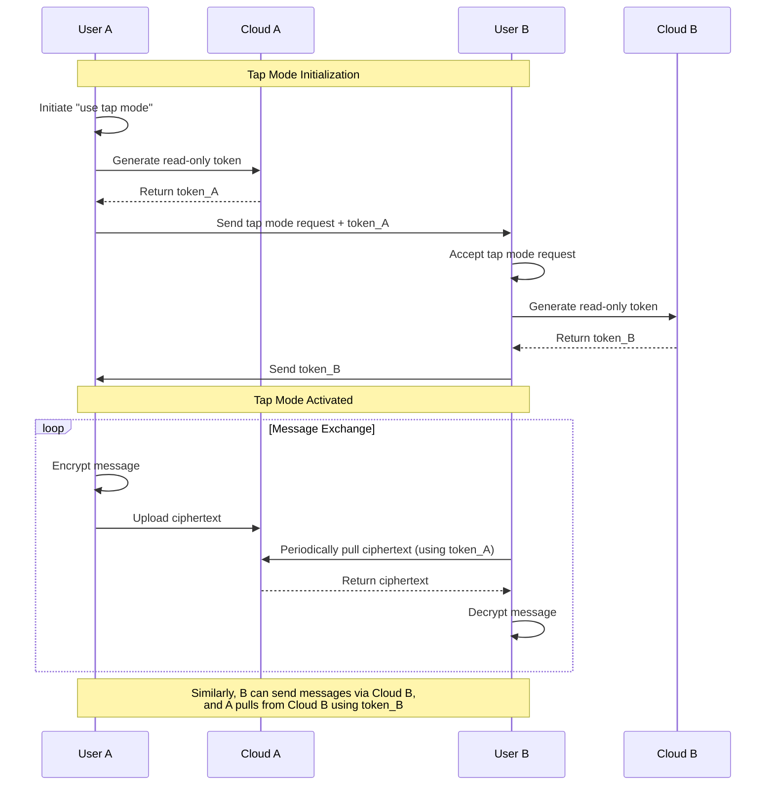
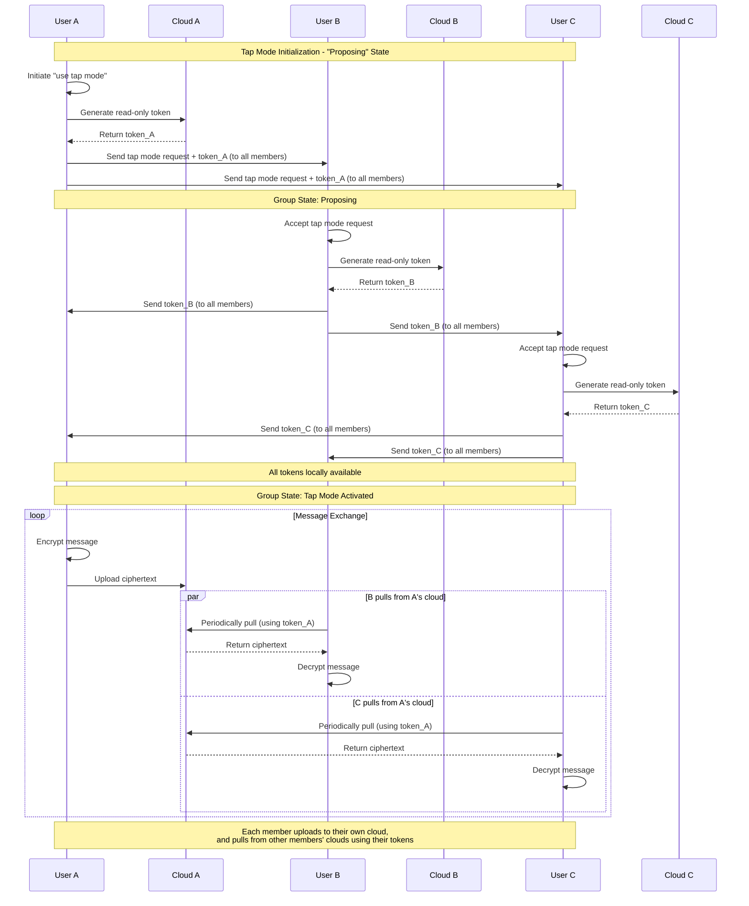

## Summary
10.21

Added a module called "tap (transport as plugin)" in Signal, changing the transmission of Signal ciphertext from Signal Server to a user-configured provider. Used in the following cases:

#### 1. Private chat:  
A initiates "use tap mode", generates a read-only token for A’s configured cloud_A, and sends it to B.  
After B accepts the request, B also sends a read-only token (of cloud_B) to A.  
Then, tap mode is activated:  
A sends messages by uploading ciphertext to cloud_A.  
B periodically pulls ciphertext from cloud_A and decrypts it.
Similarly, B can send messages via Cloud B, and A pulls from Cloud B using token_B

#### 2. Group chat:  
A initiates "use tap mode", generates a read-only token for A’s configured cloud_A, and sends it to all members. The group enters “Proposing” state.  
After receiving the request, B agrees and sends a read-only token for cloud_B to all members.  
...  
Once all members’ tokens are locally available, the group enters tap mode.  
A sends messages by uploading ciphertext to cloud_A.  
A periodically pulls ciphertext from other members’ clouds, then decrypts them.

---

## The data we upload to the cloud

```kotlin
data class TransportMessage(
    val version: String = CURRENT_VERSION,
    val messageId: String,
    val timestamp: Long,
    val senderId: String,
    val recipientId: String,
    val messageType: TransportMessageType,
    val signalCiphertext: String,  // Base64
    val signalCiphertextType: Int,
    val contentMetadata: TransportContentMetadata,
    val attachments: List<TransportAttachment> = emptyList()
)
```

### In the signalCiphertext:

A. Private Chat:

Version Byte – 1 byte, current version is `0x03`  
SignalMessage (Protobuf format) contains:  
   1. ratchetKey – 32 bytes, Diffie-Hellman temporary public key, used in Double Ratchet protocol  
   2. counter – varint, message chain counter, prevents replay attacks  
   3. previousCounter – varint, counter for the previous chain  
   4. ciphertext – variable length, actual encrypted message (AES-CBC), includes padding  
   5. MAC – 8 bytes, first 8 bytes of HMAC-SHA256, verifies message integrity and authenticity  


B. Group Chat:
Version Byte – 1 byte, current version is `0x03`  
SenderKeyMessage (Protobuf format) contains:  
1. distributionId – 16-byte UUID, unique ID for the group distribution key  
2. chainId – uint32, sending chain ID  
3. iteration – uint32, iteration counter in the chain, prevents replay attacks  
4. ciphertext – variable length, encrypted message content (AES-CBC) with padding  
5. signature – 64 bytes, Ed25519 signature to verify sender identity and message integrity  

---

## Diagrams

#### 1. Private chat:  



#### 2. Group chat:



---

## Some notes

1. An abstract class has been added; the program no longer directly depends on Tencent or AWS services. Additional storage providers can be added in the future.

2. Only the transport layer was changed; the encryption feature remains unchanged.

3. One finding: Signal’s two-person chat still uses Double Ratchet encryption, not Sender Key as used in other group chats.