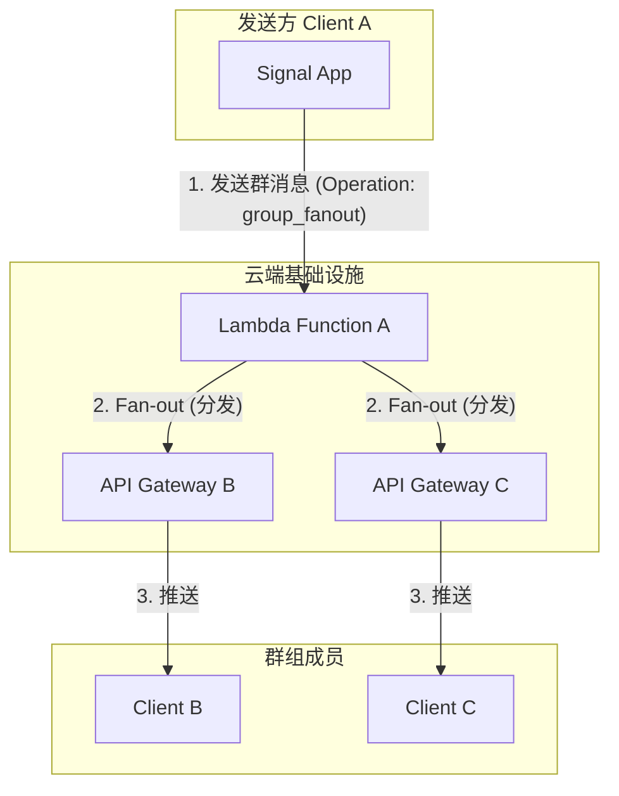

# Signal-Android Tap 模块架构

## 1. 项目概述

本项目在 Signal Android 客户端中引入了 "Tap" 模块，旨在改造传输层，使用用户自定义的存储提供商（目前支持 AWS S3 和 Tencent COS）替代 Signal Server 进行消息传递。

当前架构已从早期的轮询机制（Polling）全面升级为 **WebSocket 推送机制**。引入了 Serverless 架构（Lambda/Cloud Function + API Gateway），实现了消息的实时推送、离线存储和群聊分发。

## 2. 系统架构

### 2.1 核心组件

*   **Client (Sender/Receiver)**: 集成了 Tap 模块的 Signal 客户端。
*   **Transport Provider (COS/S3)**: 用于存储附件和离线消息。
*   **Lambda/Cloud Function**: 无服务器函数，负责消息路由、群聊分发和与 Gateway 交互。
*   **API Gateway**: 提供 WebSocket 连接，负责向在线用户推送消息，或将消息写入离线存储。

### 2.2 架构图

#### 2.2.1 私聊架构 (Private Chat)

```mermaid
graph TD
    subgraph Sender ["发送方 Client A"]
        A_App[Signal App]
        A_TP[CosTransportProvider]
        A_S3[S3 Bucket A]
    end

    subgraph Cloud ["云端基础设施"]
        Lambda[Lambda Function A]
        Gateway[API Gateway B]
        S3_Offline["S3 Bucket B (Offline)"]
    end

    subgraph Receiver ["接收方 Client B"]
        B_App[Signal App]
        B_WS[WebSocket Connection]
    end

    %% 流程
    A_App -->|"1. 上传附件"| A_S3
    A_S3 -->|"2. 返回预签名 URL"| A_App
    A_App -->|"3. 发送密文 + 元数据 (含 URL)"| A_TP
    A_TP -->|"4. Invoke (Payload)"| Lambda
    Lambda -->|"5. Webhook (POST)"| Gateway
    Gateway -->|"6a. 在线推送 (WebSocket)"| B_WS
    Gateway -->|"6b. 离线写入"| S3_Offline
    B_WS -->|"7. 接收消息"| B_App
    B_App -->|"8. 下载附件 (使用 URL)"| A_S3
    B_App -.->|"9. 离线同步 (List/Download)"| S3_Offline
```

#### 2.2.2 群聊架构 (Group Chat)

## 3. V2 Mode 生命周期

V2 Mode 是指双方通过 Tap 通道进行通信的状态。

### 3.1 私聊 V2 Mode

建立流程基于 `TapTokenExchangeMessage` 交换：

1.  **OFFER**: 发起方发送 `OFFER` 消息，包含自己的 Provider 信息、Webhook 配置 (`webhookConfig`) 和 Gateway 配置 (`gatewayConfig`)。
2.  **ACCEPT**: 接收方收到 `OFFER` 后，如果同意，回复 `ACCEPT` 消息，同样包含自己的配置信息。
3.  **CONFIRM**: 发起方收到 `ACCEPT` 后，发送 `CONFIRM` 消息，确认通道建立。
4.  **Exchange**: 双方调用 `exchangeWebhookConfiguration` 确保存储了对方的推送配置。

关闭流程：
*   任一方发送 `DISABLE` 类型的 `TapTokenExchangeMessage`，双方退回 Signal Server 通道。

### 3.2 群聊 V2 Mode

群聊 V2 Mode 需要所有成员都支持并同意。

1.  **GROUP_OFFER**: 管理员或发起人向群组发送 `GROUP_OFFER`。
2.  **GROUP_ACCEPT**: 群成员回复 `GROUP_ACCEPT`。
3.  **GROUP_ACTIVATE**: 当收集到足够多的同意（或满足策略）后，发起人发送 `GROUP_ACTIVATE`，通知全员切换到 V2 Mode。
4.  **GROUP_DISABLE**: 发送 `GROUP_DISABLE` 可关闭群组的 V2 Mode。

## 4. 消息收发流程 (V2 Mode)

### 4.1 发送流程 (Sender)

代码位置: `CosTransportProvider.push`

1.  **附件处理**:
    *   如果有附件，先上传到发送方自己的 S3/COS Bucket (`/v2-channels/{myId}/outbox/attachments/`)。
    *   生成带有有效期的 **预签名 URL (Presigned URL)**。
2.  **Payload 构建**:
    *   构建 JSON Payload，包含加密的文本消息 (`message`)、附件预签名 URL 列表 (`attachmentsPresigned`)、接收方 Gateway 信息 (`recipientGateway`)。
    *   指定操作类型: `direct_message` (私聊) 或 `group_fanout` (群聊)。
3.  **Lambda 调度**:
    *   使用 `TapLambdaDispatcher` 将 Payload 发送到配置的 Lambda 函数。
    *   Lambda 函数负责解析 Payload 并转发给接收方的 API Gateway。
4.  **重试机制**:
    *   如果 Lambda 调用失败，客户端执行指数退避重试 (1s, 2s, 4s)。

### 4.2 接收流程 (Receiver)

#### 4.2.1 在线接收 (Realtime)
代码位置: `NotificationHandler`

1.  **WebSocket 推送**: API Gateway 将消息通过 WebSocket 推送到客户端。
2.  **消息解析**: 客户端收到 JSON 数据，解析出 `TransportMessage` 和附件 URL。
3.  **附件下载**: 直接使用预签名 URL 下载附件，无需访问发送方的 Bucket 权限。
4.  **解密显示**: 进入 Signal 的标准解密和存储流程。

#### 4.2.2 离线接收 (Offline)
代码位置: `CosTransportProvider.listOfflineMessages`

1.  **离线存储**: 如果 WebSocket 推送失败（用户离线），API Gateway 将消息写入接收方的 S3/COS Bucket (`/tap-offline/{recipientHash}/`)。
2.  **上线同步**: 客户端启动或网络恢复时，主动调用 `listOfflineMessages`。
3.  **拉取处理**: 下载离线消息文件，执行与在线接收相同的解析和解密流程。
4.  **清理**: 处理完成后删除云端的离线消息文件。

## 5. 关键代码类

*   `TransportManager`: 传输层总管，负责初始化和协调。
*   `CosTransportProvider`: COS/S3 协议的具体实现，包含 `push` (发送) 和 `listOfflineMessages` (离线拉取) 逻辑。
*   `TapTokenExchangeMessage`: 定义了 V2 Mode 握手和配置交换的数据结构。
*   `NotificationConnectionManager`: 管理 WebSocket 连接。
*   `TapLambdaDispatcher`: 负责与云函数进行 HTTP 交互。

## 6. 总结

当前 Tap 模块已经完成了从"轮询"到"推送"的架构转型。新的架构利用 Serverless 能力，显著降低了延迟，减少了客户端的轮询开销，并实现了更高效的群聊消息分发。附件传输通过预签名 URL 实现了去中心化，不再依赖接收方对发送方存储的直接访问权限，提高了安全性和灵活性。
