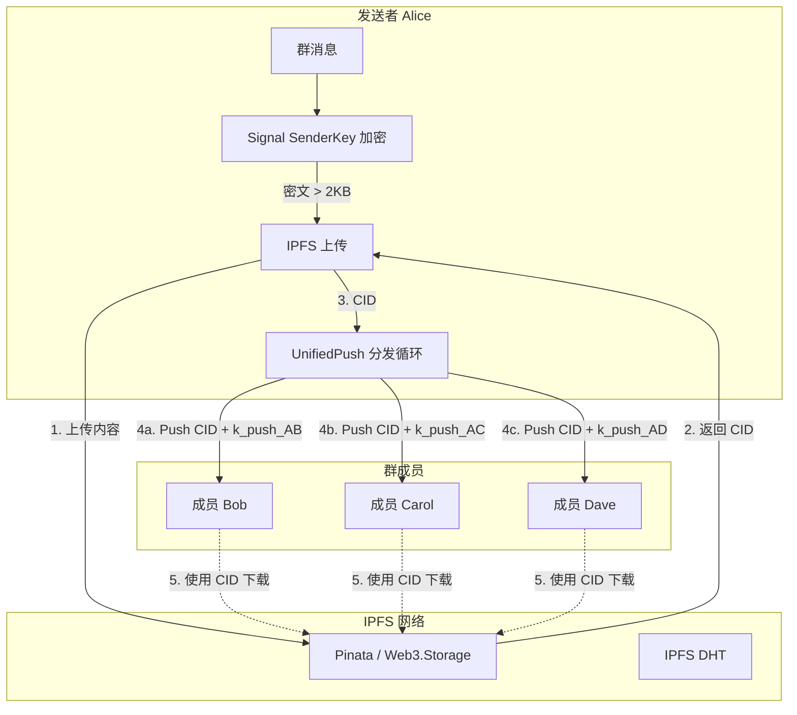

# Tap v3 Group Chat (IPFS + UnifiedPush) 设计方案

## 1. 项目概述

### 1.1 背景
Tap v3 目前实现了基于 IPFS 和 UnifiedPush 的点对点（P2P）消息传输。为了完全替代中心化云服务，必须支持群聊功能。与点对点通信不同，群聊涉及消息分发效率、成员状态一致性以及更复杂的加密密钥管理。

### 1.2 目标
在 Tap v3 现有架构基础上，设计并实现去中心化的群聊机制：
- **高效传输**: 利用 IPFS 内容寻址特性，实现"一次上传，多次引用"，解决传统 P2P 群聊的带宽浪费问题。
- **去中心化**: 不依赖 Signal Server 进行消息分发（Membership 仍可暂时依赖 Signal Group V2 逻辑，或逐步迁移）。
- **隐私保护**: 保持 Signal 的 Sender Key 群组加密机制，并在传输层叠加 Tap v3 的 k_push 加密。

---

## 2. 架构分析

### 2.1 现有 Tap v3 组件评估

| 组件 | 现状 (P2P) | 群聊复用性 | 改造需求 |
|------|-----------|------------|----------|
| **TapV3SendIntegrator** | 单播发送逻辑 | 低 | 需重构支持多播（Multicast）逻辑 |
| **IpfsGatewayManager** | 上传/下载/Pin | 高 | 需支持同一 CID 被多个接收方引用 |
| **UnifiedPushProvider** | 单点推送 | 中 | 需实现循环向所有群成员发送通知 |
| **KPushManager** | 1-on-1 密钥管理 | 中 | 需维护与每个群成员的会话密钥 |
| **TapV3ChannelTable** | 存储 P2P 通道 | 高 | 群成员即为多个 P2P 通道的集合 |

### 2.2 IPFS 在群聊中的优势
在传统 Server-based 群聊中，服务器负责将一条消息分发给 N 个成员。在纯 P2P 群聊中，发送者通常需要上传 N 次或发送 N 次数据。
**Tap v3 优势**:
- **内容去重**: 发送者只需将大文件/长消息上传一次到 IPFS Gateway。
- **带宽优化**: 获得的 CID (Content ID) 只有几十字节，通过 UnifiedPush 发送给 N 个成员，极大降低发送者带宽压力。

---

## 3. 群聊架构设计

### 3.1 核心理念: "Upload Once, Notify All"

架构采用混合分发模式：
1. **Payload Layer (IPFS)**: 承载重型数据（长文本、图片、视频）。发送者上传一次，所有接收者通过同一 CID 下载。
2. **Signaling Layer (UnifiedPush)**: 承载轻量级通知（CID 引用、短消息）。发送者通过 UnifiedPush 分别通知每个成员。

### 3.2 架构图



### 3.3 数据流详解

#### 3.3.1 发送流程
1. **Signal Layer**: 生成群消息，使用 Group Sender Key 加密得到 `SignalCiphertext`。
2. **Tap Layer (Decision)**:
   - IF `len(SignalCiphertext)` < 2KB: 进入 **Inline Multicast** 模式。
   - ELSE: 进入 **IPFS Multicast** 模式。
3. **IPFS Multicast**:
   - 上传 `SignalCiphertext` 到 IPFS Gateway。
   - 获取 `messageCid`。
   - 记录 `IpfsContentTable` (关联 GroupId，防止过早清理)。
4. **UnifiedPush Fan-out**:
   - 获取群组所有成员列表 `[M1, M2, ... Mn]`。
   - 过滤出支持 Tap v3 的成员。
   - FOR EACH member `M_i`:
     - 查找 `k_push_i` (与该成员的传输密钥)。
     - 构造 `TapV3Payload.IpfsRefs(messageCid)`。
     - 加密并推送。

#### 3.3.2 接收流程
1. **UnifiedPush**: 收到推送。
2. **Tap Layer**: 
   - 使用 `k_push_self` 解密传输层数据。
   - 提取 `TapV3Payload`。
3. **IPFS Fetch**:
   - 若是 `IpfsRefs` 类型，根据 CID 下载内容。
4. **Signal Layer**:
   - 将下载的 `SignalCiphertext` 交给 Signal 核心解密逻辑 (GroupSession)。
   - 验证 Sender Key，显示消息。

---

## 4. 成员与权限管理

### 4.1 成员列表来源
Tap v3 **不维护** 独立的群组成员列表，而是直接读取 Signal 数据库 (`recipient` 表和 `group` 表)。
- **优势**: 复用 Signal 现有的 Group V2 强一致性成员管理（基于 zk-credentials）。
- **逻辑**: 当需要发送群消息时，查询 `GroupDatabase` 获取当前成员 Recipient ID 列表。

### 4.2 混合模式兼容性
群组中可能包含 Tap v3 用户和非 Tap v3 用户（或 v2 用户）。
- **策略**: 尽力而为 (Best Effort)。
- **实现**:
  - 遍历成员列表。
  - IF member.supportsTapV3() -> Send via Tap v3 (UnifiedPush + IPFS)。
  - ELSE -> Fallback to Signal Server (如果允许) 或 标记为不可达。
  *注: 初期版本可限制仅纯 Tap v3 群组可用，或混合群组中非 v3 用户无法收到消息。*

---

## 5. 群组模式进入机制 (Entry Mechanism)

参考 Tap v2 和 Tap v3 私聊握手流程，设计基于"全员共识"的进入机制。

### 5.1 状态定义

| 状态 | 描述 | 传输方式 |
|------|------|----------|
| **NATIVE** | 默认状态 | Signal Server |
| **PROPOSING** | 升级提议中，等待成员响应 | Signal Server (控制消息) |
| **FULL_V3_ACTIVE** | 全员同意，激活 v3 模式 | Tap v3 (IPFS + UnifiedPush) |

### 5.2 握手流程 (Group Handshake)

握手的核心目的是**交换群组成员的路由信息**（UnifiedPush Endpoint 和 k_push），并在所有成员间达成一致。

#### A. 发起 (Offer)
1. **触发**: 成员 A 在群设置中点击 "Use Tap v3 mode"。
2. **检查**: 验证本地是否已配置 UnifiedPush 和 IPFS Gateway。
3. **生成**: 生成群组专用的 `k_push_inbox`（用于接收该群消息的对称密钥）。
4. **广播**: 通过 Signal Server 发送 `TapV3GroupControl.Offer` 消息。
   - Payload: `handshakeInfo` (包含 A 的 Endpoint, k_push_inbox, Gateway 偏好)。
5. **状态**: 本地状态更新为 `PROPOSING`，`agreedMembers` = {A}。

#### B. 响应 (Accept)
1. **接收**: 成员 B 收到 `Offer` 消息。
2. **交互**: 聊天界面显示横幅 "A 提议将群组升级到 Tap v3 模式"。
3. **同意**: B 点击 "同意"。
   - 生成 B 的 `k_push_inbox`。
   - 广播 `TapV3GroupControl.Accept` 消息（包含 B 的 `handshakeInfo`）。
   - 本地保存 A 的路由信息。
   - 状态更新为 `PROPOSING`，`agreedMembers` = {A, B}。
4. **被动更新**: 其他已同意的成员收到 B 的 `Accept`，保存 B 的路由信息，更新 `agreedMembers`。

#### C. 激活 (Activate)
1. **判断**: 每次 `agreedMembers` 变更时，检查是否等于群成员全集。
2. **转换**: IF `agreedMembers == totalMembers`:
   - 状态更新为 `FULL_V3_ACTIVE`。
   - UI 显示系统消息 "群组已启用 Tap v3 模式"。
   - 后续消息自动走 Tap v3 通道。

### 5.3 控制消息协议
在 Signal Group Message 基础上扩展：

```kotlin
sealed class TapV3GroupControl {
    // 提议
    data class Offer(
        val version: Int = 3,
        val handshakeInfo: TapV3HandshakeInfo // Endpoint, k_push, etc.
    )
    
    // 接受
    data class Accept(
        val handshakeInfo: TapV3HandshakeInfo
    )
    
    // 禁用/回退
    data class Disable(
        val reason: String?
    )
}
```

### 5.4 隐私与安全
- **路由信息广播**: 虽然 Endpoint 和 k_push 通过 Signal Server 广播，但：
  - Signal Server 只能看到加密的 SenderKey Message，无法获知 Endpoint。
  - 群成员之间互信，共享 `k_push` 是为了防止外部推送服务商窥探，而非防群友。
- **一致性**: 依赖 Signal Group V2 的一致性保证所有成员收到相同的控制消息序列。

---

## 6. 数据库设计变更

无需新增表，但需扩展现有表用途。

### 5.1 `tap_v3_ipfs_content`
需要支持群组上下文，以便正确管理生命周期（例如：只要群组存在，或者消息未被所有成员确认，就不应该 Unpin，虽然目前策略是基于时间的）。

**修改建议**:
- `recipient_id` 字段目前存储接收者 ID。对于群聊，该字段应存储 `GroupId`。
- 新增 `ref_count` (引用计数): 记录该 CID 被发送给了多少人（统计用）。

---

## 7. 实施路线图

### Phase 1: 基础重构 (Alpha)
**目标**: 让发送集成器支持"一对多"逻辑。
- [ ] 重构 `TapV3SendIntegrator`，将 `sendMessage` 拆分为 `preparePayload` (上传 IPFS) 和 `dispatchPush` (推送)。
- [ ] 修改 `TapV3MessageRouter` 以识别群组 Recipient。
- [ ] 实现 `GroupMemberResolver`: 给定 GroupId，返回 List<RecipientId>。

### Phase 1.5: 群组握手与状态管理 (Entry Mechanism)
**目标**: 实现群组 v3 模式的进入、协商和状态存储。
- [ ] **数据库**: 创建 `tap_v3_group_status` 表，存储群组状态、发起人、已同意成员。
- [ ] **协议**: 定义 `TapV3GroupControl` 消息结构 (Offer/Accept/Disable)。
- [ ] **UI**: 
  - 在群组设置页添加 "Use Tap v3 mode" 开关。
  - 实现提议通知横幅 (Banner) 和同意交互对话框。
- [ ] **逻辑**: 
  - 实现控制消息的发送与处理 (`TapV3GroupControlHandler`)。
  - 实现收到 `Accept` 消息时自动更新 `TapV3ChannelTable` 中的成员路由信息。
  - 实现状态自动流转 (Native -> Proposing -> Active)。

### Phase 2: 群聊发送实现 (Beta)
**目标**: 实现群消息的完整发送链路。
- [ ] 实现 `TapV3GroupSendJob`: 替代 Signal 原生 `GroupSendJob`。
- [ ] 实现循环推送逻辑 (Fan-out)。
- [ ] 优化 IPFS 上传：确保群发时只上传一次。
- [ ] 单元测试：模拟 5-10 人的群组发送。

### Phase 3: 接收与同步 (Release)
**目标**: 接收端处理与性能优化。
- [x] 验证接收端逻辑（参考Tap v2的群聊接入逻辑和tap v3的私聊接入逻辑）。

- [x] 优化：并发推送（使用协程并发发送 UnifiedPush 请求，而不是串行）。

---

## 8. 关键API定义

### 7.1 TapV3SendIntegrator 扩展

```kotlin
// 原有单播接口
suspend fun sendMessage(recipientId: String, ...): SendResult

// 新增多播接口
suspend fun sendGroupMessage(
    groupId: String,
    memberIds: List<String>,
    signalEncrypted: ByteArray,
    attachments: List<Attachment>
): GroupSendResult

data class GroupSendResult(
    val successCount: Int,
    val failureCount: Int,
    val failedMembers: Map<String, Exception>
)
```

### 7.2 内部逻辑 (伪代码)

```kotlin
suspend fun sendGroupMessage(...) {
    // 1. 准备 Payload
    val payload: TapV3Payload = if (isLarge(signalEncrypted, attachments)) {
        // 上传 IPFS (只做一次)
        val messageCid = ipfsManager.upload(signalEncrypted)
        val attachmentCids = attachments.map { ipfsManager.upload(it) }
        TapV3Payload.IpfsRefs(messageCid, attachmentCids)
    } else {
        TapV3Payload.Inline(signalEncrypted)
    }

    // 2. 分发 (并发)
    coroutineScope {
        memberIds.map { memberId ->
            async {
                val endpoint = channelTable.getEndpoint(memberId)
                val kPush = channelTable.getKPush(memberId)
                // 加密 payload (每个成员使用不同的 k_push)
                val encrypted = crypto.encrypt(payload, kPush)
                pushProvider.send(endpoint, encrypted)
            }
        }.awaitAll()
    }
}
```

## 9. 风险与缓解

| 风险 | 描述 | 缓解措施 |
|------|------|----------|
| **推送风暴** | 发送给 100 人群组需要 100 次 HTTP 请求 | 使用协程并发；在 UI 显示进度条；限制群组最大人数（如 50）。 |
| **带宽放大** | 虽然 IPFS 节省了带宽，但发送 100 个 HTTP 请求仍消耗流量 | 推送 Payload 极小（<500 bytes），100 人仅 50KB，可接受。 |
| **成员状态不一致** | 部分成员发送成功，部分失败 | UI 显示"部分送达"；提供重试按钮（仅重试失败的成员）。 |
| **IPFS 隐私** | 群文件由单一 CID 索引，若泄露则全群可见 | Signal Sender Key 保证了即使获得文件，无 Key 也无法解密内容。 |